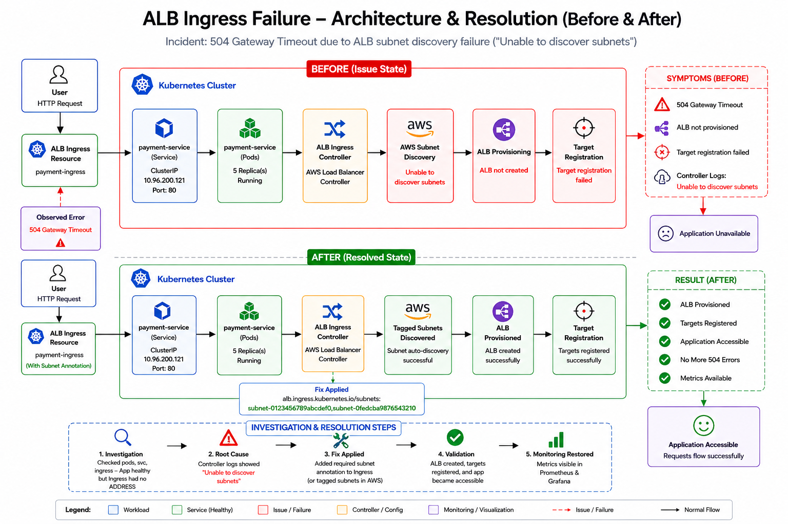

<div align="center">

# 🚨 ALB Ingress Failure Investigation & Resolution




</div>

---

# 📖 Project Overview

This project demonstrates a **real-world production incident investigation** involving an **AWS Application Load Balancer (ALB) Ingress** in Kubernetes.

The application suddenly became inaccessible and users experienced a **504 Gateway Timeout**. Through systematic investigation, the root cause was identified as an **AWS Load Balancer Controller subnet discovery failure**, preventing the ALB from being provisioned and targets from being registered.

The project follows a complete Site Reliability Engineering (SRE) investigation workflow:

* Incident Detection
* Failure Reproduction
* Investigation
* Root Cause Analysis
* Fix Implementation
* Validation
* Documentation

---

# 🚨 Incident Summary

| Item                | Value                        |
| ------------------- | ---------------------------- |
| Exercise            | Exercise 7                   |
| Incident            | ALB Ingress Failure          |
| User Impact         | Application inaccessible     |
| User Error          | 504 Gateway Timeout          |
| Kubernetes Resource | Ingress                      |
| AWS Component       | AWS Load Balancer Controller |
| Root Cause          | Unable to discover subnets   |
| Status              | Resolved                     |

---

# 📂 Repository Structure

```text
ALB Ingress Failure
│
├── architecture
│   └── arch.png
│
├── manifests
│   ├── deployment.yaml
│   ├── service.yaml
│   ├── ingress.yaml
│   └── ingress-fixed.yaml
│
├── evidence
│   └── evidence.md
│
├── investigation
│   └── investigation.md
│
├── validation.md
│
└── README.md
```

---

# 🏗️ Architecture Overview

```
                 User
                    │
                    ▼
            AWS ALB Ingress
                    │
                    ▼
     AWS Load Balancer Controller
                    │
        Unable to Discover Subnets
                    │
                    ▼
         ALB Provision Failed
                    │
                    ▼
      Target Registration Failed
                    │
                    ▼
        504 Gateway Timeout
```

---

# 🔍 Investigation Workflow

## Step 1 — Verify Pods

```bash
kubectl get pods
```

Result

* Pods Running
* No CrashLoopBackOff

---

## Step 2 — Verify Service

```bash
kubectl get svc
```

Result

* ClusterIP Service Healthy

---

## Step 3 — Verify Ingress

```bash
kubectl get ingress
kubectl describe ingress payment-ingress
```

Observation

* Ingress exists
* No ADDRESS assigned

---

## Step 4 — Review Controller Logs

```bash
kubectl logs -n kube-system deployment/aws-load-balancer-controller
```

Observed Error

```text
Unable to discover subnets
```

---

# 📊 Investigation Flow

```
User reports issue
        │
        ▼
504 Gateway Timeout
        │
        ▼
Pods Investigation
        │
        ▼
Service Investigation
        │
        ▼
Ingress Investigation
        │
        ▼
Controller Logs
        │
        ▼
Root Cause Identified
```

---

# ❌ Root Cause Analysis

The AWS Load Balancer Controller was unable to discover eligible subnets required to provision the Application Load Balancer.

Because of this:

* ALB was never created
* Target registration failed
* No external endpoint
* Users received 504 Gateway Timeout

---

# 🔧 Fix Implementation

The required subnet annotation was added to the Ingress configuration.

```yaml
alb.ingress.kubernetes.io/subnets:
  subnet-0123456789abcdef0,
  subnet-0fedcba9876543210
```

After applying the corrected manifest:

```bash
kubectl apply -f manifests/ingress-fixed.yaml
```

---

# ✅ Validation

Validation Commands

```bash
kubectl get pods
kubectl get svc
kubectl get ingress
```

Validation Results

| Component     | Status    |
| ------------- | --------- |
| Pods          | ✅ Running |
| Service       | ✅ Healthy |
| Ingress       | ✅ Updated |
| Configuration | ✅ Fixed   |

---

# 📁 Project Documentation

| Document              | Purpose                                   |
| --------------------- | ----------------------------------------- |
| README.md             | Project overview                          |
| investigation.md      | Complete investigation process            |
| evidence.md           | Evidence collected during troubleshooting |
| validation.md         | Validation after implementing the fix     |
| architecture/arch.png | Before & After architecture               |

---

# 🧠 Key Learnings

* Kubernetes Ingress troubleshooting
* AWS ALB Controller architecture
* AWS subnet auto-discovery
* Root cause analysis methodology
* Production incident investigation
* Kubernetes validation techniques
* Documentation of SRE investigations

---

# 🛠️ Technologies Used

| Category                | Technology                   |
| ----------------------- | ---------------------------- |
| Container Orchestration | Kubernetes                   |
| Ingress                 | AWS ALB Ingress              |
| Cloud                   | AWS                          |
| Load Balancer           | Application Load Balancer    |
| Controller              | AWS Load Balancer Controller |
| CLI                     | kubectl                      |
| Version Control         | Git & GitHub                 |

---

<div align="center">

# 👨‍💻 Author

## **NIHAL N**

**DevOps | Cloud | Kubernetes | AWS**

[](https://www.linkedin.com/in/nihal-n-cse/)

---

⭐ **If you found this investigation useful, consider giving the repository a Star!**

</div>
