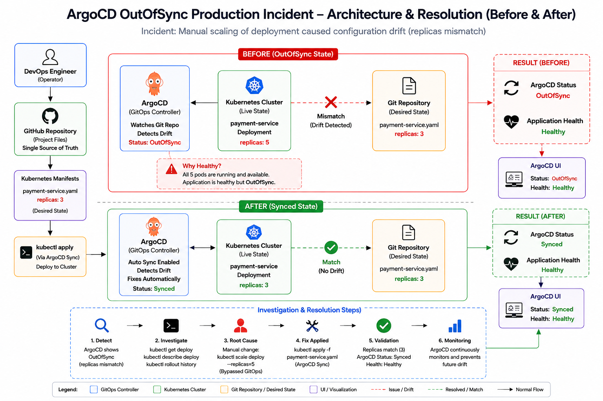

<div align="center">

# 🚨 ArgoCD OutOfSync Production Incident Investigation




</div>

---

# 📖 Project Overview

This project simulates a real-world **ArgoCD Production Incident** where the application remains healthy, but ArgoCD continuously reports:

```text
Status : OutOfSync
Health : Healthy
```

The incident occurred because the deployment's replica count was manually modified in the Kubernetes cluster, creating **configuration drift** between Git and the live environment.

This investigation demonstrates how to:

* Reproduce an ArgoCD OutOfSync incident
* Investigate configuration drift
* Identify the root cause
* Restore GitOps compliance
* Validate synchronization
* Implement preventive controls

---

# 🎯 Incident Summary

## Desired State (Git Repository)

```yaml
replicas: 3
```

## Actual Cluster State

```yaml
replicas: 5
```

## ArgoCD Status

```text
Status : OutOfSync
Health : Healthy
```

---

# 📂 Project Structure

```text
ArgoCD OutOfSync Production Incident
│
├── architecture
│   └── arch.png
│
├── evidence
│   └── evidence.md
│
├── investigation
│   └── investigation.md
│
├── manifests
│   └── payment-service.yaml
│
├── README.md
└── validation.md
```

---

# 🏗️ Architecture Overview

## Before Fix (OutOfSync)

```text
Git Repository
replicas: 3
      │
      ▼

   ArgoCD
      │
      ▼

Kubernetes Cluster
replicas: 5

Status : OutOfSync
Health : Healthy
```

### Why Healthy?

All 5 application pods were running successfully.

The application remained operational, but the cluster state no longer matched Git.

---

## After Fix (Synced)

```text
Git Repository
replicas: 3
      │
      ▼

   ArgoCD
      │
      ▼

Kubernetes Cluster
replicas: 3

Status : Synced
Health : Healthy
```

---

# 🔍 Investigation Workflow

## Step 1 – Verify Desired State

```bash
type manifests\payment-service.yaml
```

Result:

```yaml
replicas: 3
```

---

## Step 2 – Verify Live Cluster

```bash
kubectl get deploy payment-service
```

Result:

```text
payment-service   5/5
```

---

## Step 3 – Analyze Deployment

```bash
kubectl describe deploy payment-service
```

Evidence:

```text
Scaled up replica set from 3 to 5
```

---

## Step 4 – Review Rollout History

```bash
kubectl rollout history deployment/payment-service
```

Result:

```text
REVISION  CHANGE-CAUSE
1         <none>
```

---

## Step 5 – Compare Desired vs Actual

| Source             | Replicas |
| ------------------ | -------- |
| Git Repository     | 3        |
| Kubernetes Cluster | 5        |

Result:

```text
Configuration Drift Detected
```

---

# 🧠 Root Cause Analysis

The deployment replica count was modified directly in the Kubernetes cluster using:

```bash
kubectl scale deploy payment-service --replicas=5
```

This change bypassed the GitOps workflow.

Because Git still defined:

```yaml
replicas: 3
```

ArgoCD detected drift and reported:

```text
Status : OutOfSync
```

However, because all replicas were healthy:

```text
Health : Healthy
```

---

# 🛠️ Fix Implementation

Restore the cluster state to match Git.

```bash
kubectl apply -f manifests/payment-service.yaml
```

Result:

```text
deployment.apps/payment-service configured
```

---

# ✅ Validation

## Verify Replicas

```bash
kubectl get deploy payment-service
```

Result:

```text
payment-service   3/3
```

---

## Verify Deployment State

```bash
kubectl describe deploy payment-service
```

Evidence:

```text
Scaled down replica set from 5 to 3
```

---

## Final State

| Component          | Status       |
| ------------------ | ------------ |
| Git Repository     | replicas = 3 |
| Kubernetes Cluster | replicas = 3 |
| ArgoCD Sync Status | Synced       |
| Application Health | Healthy      |

---

# 🚫 Prevention Strategy

## 1. Enable ArgoCD Auto-Sync

Automatically reconcile drift.

## 2. Restrict Direct kubectl Access

Prevent unauthorized production changes.

## 3. Implement RBAC

Limit scaling permissions to approved operators.

## 4. Enable Kubernetes Audit Logs

Track who performed changes.

## 5. Configure Drift Alerts

Alert immediately when Git and cluster diverge.

---

# 📊 Investigation Timeline

```text
Deployment Created
        │
        ▼

Git State = 3
Cluster = 3

        │
        ▼

Manual Scale Operation

kubectl scale --replicas=5

        │
        ▼

Git State = 3
Cluster = 5

        │
        ▼

ArgoCD Detects Drift

Status : OutOfSync

        │
        ▼

Git Reconciliation

kubectl apply

        │
        ▼

Git State = 3
Cluster = 3

        │
        ▼

Status : Synced
Health : Healthy
```

---

# 🎓 Key Learnings

* Healthy does not always mean Synced.
* ArgoCD continuously compares Git and cluster state.
* Manual changes create configuration drift.
* Git must remain the single source of truth.
* GitOps reduces configuration inconsistencies.
* Auto-Sync helps automatically correct drift.
* Audit logging is critical for production investigations.

---

<div align="center">

## 👨‍💻 Author

**NIHAL N** — DevSecOps & Cloud Engineer

---

⭐ If this project helped you understand GitOps troubleshooting, consider giving it a star.

</div>
