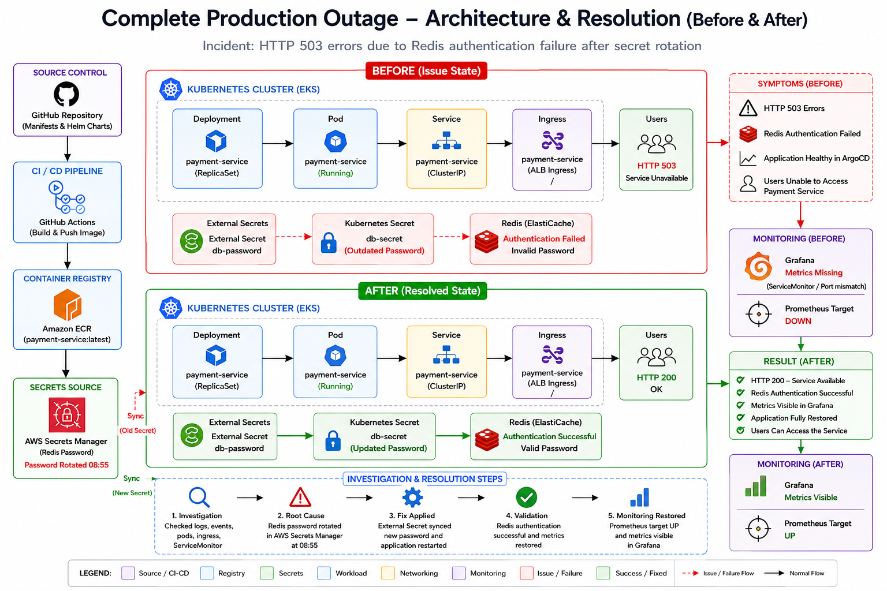

<div align="center">

# 🚨 Complete Production Outage – Root Cause Analysis & Resolution




</div>

---

# 📖 Project Overview

This project simulates a **real-world production outage** in a Kubernetes environment where users suddenly experienced **HTTP 503 Service Unavailable** despite the infrastructure appearing completely healthy.

The objective is to perform a complete **Production Incident Response**, investigate every infrastructure layer, identify the root cause, implement the fix, validate service recovery, and document the complete Root Cause Analysis (RCA).

The incident demonstrates how **application dependency failures** can occur even when Kubernetes, ArgoCD, and networking components report healthy status.

---

# 📂 Repository Structure

```
Complete Production Outage
│
├── architecture
│   └── architecture.png
│
├── manifests
│   ├── payment-service.yaml
│   └── payment-service-fixed.yaml
│
├── investigation
│   └── investigation.md
│
├── evidence
│   └── evidence.md
│
├── validation.md
│
└── README.md
```

---

# 🏗 Production Architecture

```
GitHub
     │
     ▼
GitHub Actions
     │
     ▼
Amazon ECR
     │
     ▼
ArgoCD
     │
     ▼
Amazon EKS
     │
     ▼
payment-service
     │
     ▼
External Secrets Operator
     │
     ▼
AWS Secrets Manager
     │
     ▼
Redis
```

---

# 🔧 Technology Stack

| Layer          | Technology                | Purpose                             |
| -------------- | ------------------------- | ----------------------------------- |
| Cloud          | AWS EKS                   | Kubernetes Cluster                  |
| GitOps         | ArgoCD                    | Continuous Deployment               |
| Secrets        | AWS Secrets Manager       | Store Redis password                |
| Secret Sync    | External Secrets Operator | Synchronize secrets into Kubernetes |
| Container      | Docker                    | Application image                   |
| Registry       | Amazon ECR                | Image storage                       |
| Kubernetes     | Pods, Services, Ingress   | Application deployment              |
| Database Cache | Redis                     | Backend cache                       |

---

# 🚨 Symptoms Observed

Although every Kubernetes component appeared healthy, users experienced production downtime.

| Component   | Status                  |
| ----------- | ----------------------- |
| ArgoCD      | ✅ Healthy               |
| Pods        | ✅ Running               |
| Ingress     | ✅ Healthy               |
| Kubernetes  | ✅ Healthy               |
| Application | ❌ HTTP 503              |
| Redis       | ❌ Authentication Failed |

---

# 🔍 Investigation Process

The production investigation followed a structured approach.

## Step 1

Verify ArgoCD

Result:

* Application Synced
* Healthy

---

## Step 2

Verify Kubernetes

Commands

```bash
kubectl get pods
kubectl describe pod payment-service
```

Result

* Running
* Ready
* No CrashLoopBackOff

---

## Step 3

Review Application Logs

```bash
kubectl logs payment-service
```

Observed

```
Starting payment-service...
ERROR: Cannot connect to Redis
HTTP 503 Service Unavailable
```

---

## Step 4

Inspect Kubernetes Secret

```
kubectl describe secret db-secret
```

Verified

* Secret exists
* Managed by External Secrets

---

## Step 5

Inspect External Secret

```
kubectl get externalsecrets
kubectl describe externalsecret db-password
```

Verified

* SecretSynced
* Refresh Interval 1 minute
* Previous synchronization failures recorded

---

## Step 6

Redis Investigation

Redis authentication failed because the application attempted to connect using outdated credentials after password rotation.

---

# 🎯 Root Cause Analysis

The Redis password stored in **AWS Secrets Manager** was rotated before the application started using the updated Kubernetes Secret.

Although:

* Kubernetes Pods were healthy
* ArgoCD deployment succeeded
* Ingress was operational

the application still attempted to authenticate with Redis using an outdated password.

This resulted in:

```
Application
        │
        ▼
Redis Authentication Failed
        │
        ▼
Application returned HTTP 503
```

---

# 🛠 Fix Implementation

The following corrective actions were performed.

✅ Verified External Secret synchronization

✅ Updated Kubernetes Secret

✅ Restarted payment-service

✅ Reloaded application credentials

---

Updated application logs

```
Starting payment-service...
Loading updated Kubernetes Secret...
Connecting to Redis...
Redis authentication successful
Application started successfully
```

---

# ✅ Validation

Commands executed

```bash
kubectl get pods

kubectl logs payment-service
```

Validation Results

| Check                | Result |
| -------------------- | ------ |
| Pod Running          | ✅      |
| Redis Authentication | ✅      |
| HTTP 503 Removed     | ✅      |
| Application Healthy  | ✅      |

---

# 📊 Root Cause Summary

| Layer              | Status                                             |
| ------------------ | -------------------------------------------------- |
| ArgoCD             | Healthy                                            |
| Kubernetes         | Healthy                                            |
| Ingress            | Healthy                                            |
| External Secrets   | Synced                                             |
| Redis Password     | Rotated                                            |
| Application Secret | Outdated                                           |
| Final Root Cause   | Redis authentication failure after secret rotation |

---

# 🚀 Long-Term Prevention

* Configure alerts for External Secret synchronization failures.
* Monitor Redis authentication failures.
* Restart workloads automatically after secret rotation when required.
* Validate secret synchronization during deployments.
* Add synthetic health checks for Redis connectivity.
* Create dashboards for External Secrets synchronization status.
* Configure incident alerts before users experience downtime.

---

# 📚 Key Learnings

* Healthy Kubernetes resources do not guarantee application health.
* Secret rotation requires proper synchronization across dependent services.
* External Secrets should be continuously monitored.
* Application logs often reveal dependency failures that infrastructure health checks cannot detect.
* Structured RCA significantly reduces production recovery time.

---

<div align="center">

# 👨‍💻 Author

**NIHAL N** 

 DevOps & Cloud Engineer

⭐ If this project helped you understand production incident response and Kubernetes troubleshooting, consider giving the repository a ⭐.

</div>

---