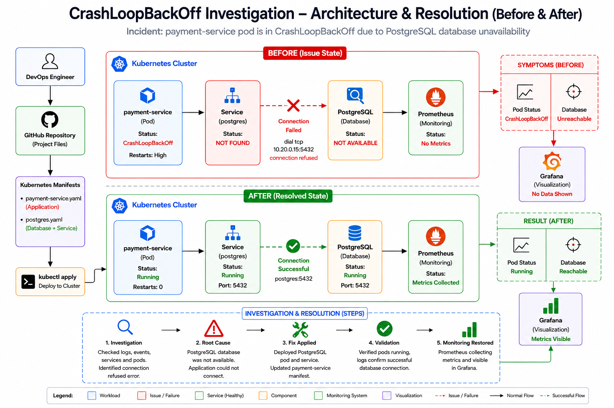

<div align="center">

# 🚨 CrashLoopBackOff Investigation & Resolution


### Production Incident Investigation – Kubernetes CrashLoopBackOff



</div>

---

# 📌 Incident Summary

A Kubernetes pod named **payment-service** entered the **CrashLoopBackOff** state and continuously restarted.

### Error

```text
panic:
dial tcp 10.20.0.15:5432
connection refused
```

### Kubernetes Events

```text
Back-off restarting failed container
```

---

# 🎯 Investigation Objectives

Determine whether the incident was caused by:

- 🌐 DNS Issue
- 🗄️ Database Issue
- 🔐 Secret Issue

Perform Root Cause Analysis and implement a permanent fix.

---

# 🏗️ Environment

| Component | Technology |
|------------|------------|
| Container Orchestration | Kubernetes |
| Application | payment-service |
| Database | PostgreSQL |
| Investigation Tool | kubectl |
| Platform | Local Kubernetes Cluster |

---

# 📂 Repository Structure

```text
CrashLoopBackOff-Investigation/
│
├── manifests/
│   ├── payment-service.yaml
│   └── postgres.yaml
│
├── investigation/
│   └── investigation.md
│
├── evidence/
│   └── evidence.md
│
├── screenshots/
│
├── validation.md
│
├── README.md
│
├── architecture-before.png
└── architecture-after.png
```

---

# 🚨 Incident State (Before Fix)

```text
payment-service
      │
      ▼
CrashLoopBackOff
      │
      ▼
dial tcp 10.20.0.15:5432
connection refused
```

### Pod Status

```bash
kubectl get pods
```

Output:

```text
payment-service   CrashLoopBackOff
```

---

# 🔍 Investigation Process

## Step 1 – Log Analysis

```bash
kubectl logs payment-service
```

Output:

```text
panic:
dial tcp 10.20.0.15:5432
connection refused
```

### Finding

✅ Application unable to connect to database.

---

## Step 2 – Event Analysis

```bash
kubectl describe pod payment-service
```

Output:

```text
Back-off restarting failed container
```

### Finding

✅ Kubernetes repeatedly restarted the failed container.

---

## Step 3 – DNS Investigation

Application attempted connection to:

```text
10.20.0.15:5432
```

### Finding

❌ DNS not involved.

Reason:

- Application uses IP address.
- No hostname lookup performed.
- No "no such host" error.

### Result

```text
DNS Issue = NO
```

---

## Step 4 – Database Investigation

### Check Services

```bash
kubectl get svc | findstr postgres
```

Output:

```text
No PostgreSQL Service Found
```

### Check Pods

```bash
kubectl get pods
```

Output:

```text
No PostgreSQL Pod Found
```

### Finding

✅ Database unavailable.

### Result

```text
Database Issue = YES
```

---

## Step 5 – Secret Investigation

```bash
kubectl describe pod payment-service
```

Output:

```text
Environment: <none>
```

### Finding

✅ No Secret references found.

### Result

```text
Secret Issue = NO
```

---

# 🎯 Root Cause Analysis

## Root Cause

The payment-service application attempted to connect to PostgreSQL on port **5432**.

However, no PostgreSQL service or database pod was available in the cluster.

The application exited with code **1**, causing Kubernetes to repeatedly restart the container and eventually place the pod into **CrashLoopBackOff** state.

---

# 🔧 Fix Implementation

## Deploy PostgreSQL

```bash
kubectl apply -f manifests/postgres.yaml
```

Created:

- PostgreSQL Pod
- PostgreSQL Service

---

## Update Application

Recreated payment-service pod after database availability was restored.

```bash
kubectl delete pod payment-service
kubectl apply -f manifests/payment-service.yaml
```

---

# ✅ Validation

## Pod Health

```bash
kubectl get pods
```

Output:

```text
payment-service   1/1 Running
postgres          1/1 Running
```

---

## Application Logs

```bash
kubectl logs payment-service
```

Output:

```text
Connecting to PostgreSQL...
Database connection successful
```

### Result

```text
INCIDENT RESOLVED
```

---

# 📊 Investigation Summary

| Investigation Area | Result |
|-------------------|---------|
| DNS | ❌ Not Root Cause |
| Secrets | ❌ Not Root Cause |
| Database | ✅ Root Cause |
| Application Recovery | ✅ Successful |

---

# 🏛️ Architecture

## Before Fix

### Flow

```text
payment-service
      │
      ▼
PostgreSQL (Unavailable)
      │
      ▼
Connection Refused
      │
      ▼
CrashLoopBackOff
```

---

## After Fix

### Flow

```text
payment-service
      │
      ▼
PostgreSQL (Running)
      │
      ▼
Connection Successful
      │
      ▼
Application Running
```

---

# 🏆 Key Learnings

- Kubernetes CrashLoopBackOff troubleshooting
- Pod log analysis
- Pod event investigation
- Database connectivity debugging
- Root Cause Analysis (RCA)
- Incident validation procedures
- Production troubleshooting workflow

---

<div align="center">

## 👨‍💻 Author

### **NIHAL N**

DevOps | Kubernetes | Cloud

[](https://www.linkedin.com/in/nihal-n-cse/)

---

⭐ **If this project helped you learn Kubernetes troubleshooting, consider starring the repository.**

</div>