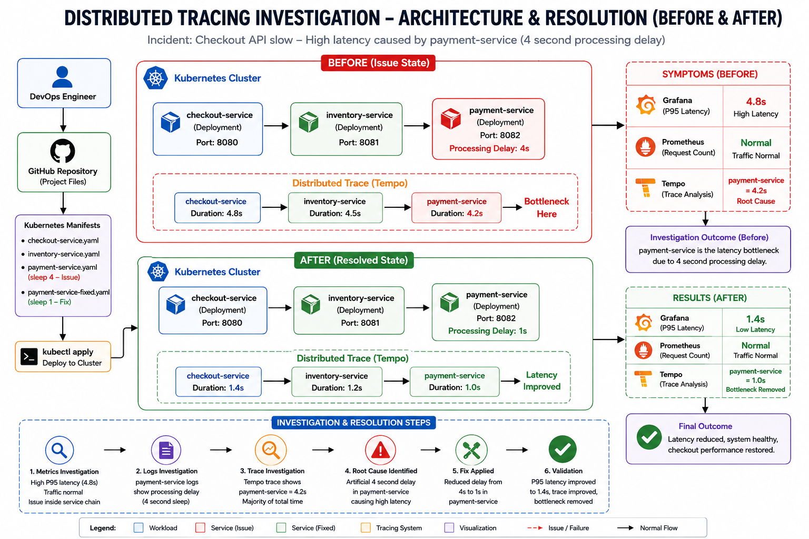

<div align="center">

# 🔍 Distributed Tracing Investigation – Kubernetes Observance




</div>

---

## 📂 Project Structure

| Folder           | Description                                      |
| ---------------- | ------------------------------------------------ |
| 📁 architecture  | Before & After architecture diagrams             |
| 📁 manifests     | Kubernetes manifests used for simulation         |
| 📁 investigation | Investigation report and root cause analysis     |
| 📁 evidence      | Incident evidence collected during investigation |
| 📄 validation.md | Validation and resolution report                 |


---

## 🧠 Incident Overview

A production incident was reported where users experienced slow checkout performance.

### User Complaint

```text
Checkout API is slow
```

### Initial Observations

| Tool       | Observation                                       |
| ---------- | ------------------------------------------------- |
| Grafana    | P95 Latency = 4.8 seconds                         |
| Prometheus | Request count normal                              |
| Tempo      | Trace shows payment-service consuming 4.2 seconds |

---

## 🎯 Investigation Objective


* 📊 Metrics
* 📜 Logs
* 🔍 Distributed Traces


---

## 🏗️ Service Architecture

```text
checkout-service
        │
        ▼
inventory-service
        │
        ▼
payment-service
```

The checkout request travels through multiple services before completing.

---

## 📊 Metrics Investigation

### Grafana

Observed:

```text
P95 Latency = 4.8s
```

### Prometheus

Observed:

```text
Request Count = Normal
Error Rate = 0%
```

### Analysis

Traffic volume was healthy.

No abnormal request spike existed.

The issue was occurring inside the service chain.

---

## 📜 Logs Investigation

### payment-service Logs

```text
payment-service started
Processing payment...
Processing payment...
Processing payment...
```

Application review revealed:

```bash
sleep 4
```

inside the request processing workflow.

### Finding

payment-service was introducing a significant processing delay.

---

## 🔍 Distributed Trace Investigation

### Tempo Trace

```text
checkout-service    4.8s

inventory-service   4.5s

payment-service     4.2s
```

### Trace Analysis

```text
Total Request Time = 4.8s

payment-service = 4.2s
```

Approximately 87% of total request duration originated from payment-service.

### Finding

Distributed tracing clearly identified payment-service as the latency bottleneck.

---

## 🚨 Root Cause Analysis

### Root Cause

payment-service contained an artificial processing delay.

Problematic code:

```bash
sleep 4
```

### Impact

* Increased checkout latency
* Poor user experience
* Elevated P95 response times

### Evidence

| Source     | Finding                   |
| ---------- | ------------------------- |
| Grafana    | P95 latency 4.8s          |
| Prometheus | Traffic normal            |
| Tempo      | payment-service 4.2s      |
| Logs       | Processing delay observed |

---

## 🔧 Fix Implementation

### Before

```bash
sleep 4
```

### After

```bash
sleep 1
```

### Deployment

```powershell
kubectl delete pod payment-service --force --grace-period=0

kubectl apply -f manifests\payment-service-fixed.yaml
```

---

## ✅ Validation

### Pre-Fix

| Metric            | Value |
| ----------------- | ----- |
| Checkout Latency  | 4.8s  |
| Inventory Latency | 4.5s  |
| Payment Latency   | 4.2s  |

---

### Post-Fix

| Metric            | Value |
| ----------------- | ----- |
| Checkout Latency  | 1.4s  |
| Inventory Latency | 1.2s  |
| Payment Latency   | 1.0s  |

---

### Result

✅ Latency bottleneck removed

✅ Checkout API performance restored

✅ Service chain operating normally

---

## 📈 Investigation Workflow

```text
User Complaint
      │
      ▼
Grafana Metrics Review
      │
      ▼
Prometheus Analysis
      │
      ▼
Logs Investigation
      │
      ▼
Tempo Trace Analysis
      │
      ▼
Root Cause Identified
      │
      ▼
Fix Applied
      │
      ▼
Validation
```

---

## 🎓 Key Learnings

### Metrics

Metrics identify that a problem exists.

### Logs

Logs provide service-level behavior visibility.

### Traces

Distributed traces identify where time is spent across services.

### Observability

Combining Metrics + Logs + Traces enables rapid root cause identification.

---

## 🚀 Skills Demonstrated

* Kubernetes Troubleshooting
* Distributed Tracing
* Grafana Analysis
* Prometheus Monitoring
* Tempo Trace Analysis
* Incident Response
* Root Cause Analysis
* Observability Engineering
* Performance Optimization
* DevOps Investigation Workflow

---

<div align="center">

## 👨‍💻 Author

**NIHAL N** — DevSecOps & Cloud Engineer

[](https://www.linkedin.com/in/nihal-n-cse/)

---

⭐ If this project helped you understand distributed tracing and observability, consider giving it a star!

</div>
