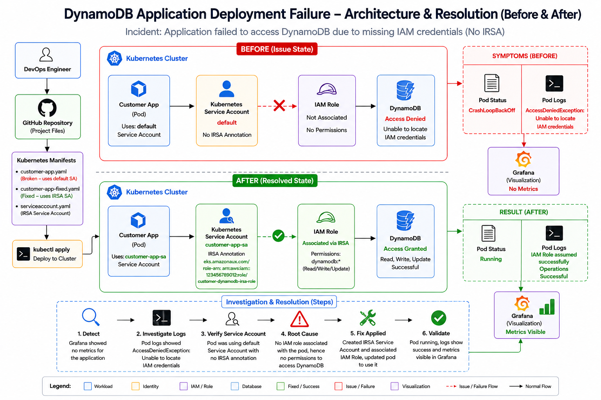

<div align="center">

# 🚀 DynamoDB Application Deployment – IRSA Investigation & Resolution




</div>

---

# 📌 Project Overview

This project demonstrates the investigation and resolution of an application deployment issue where a Kubernetes application failed to access **Amazon DynamoDB** due to missing **IAM Roles for Service Accounts (IRSA)**.

Instead of using AWS Access Keys inside the application, the deployment follows AWS security best practices by authenticating through an IAM Role associated with a Kubernetes Service Account.

The project walks through the complete troubleshooting lifecycle:

- Reproduce the incident
- Investigate the failure
- Identify the root cause
- Implement the fix
- Validate successful DynamoDB access

---

# 🎯 Exercise Objective

Deploy an application capable of performing:

- Read Customer
- Write Customer
- Update Customer

using

- Amazon DynamoDB
- IAM Roles for Service Accounts (IRSA)

without using

- AWS Access Keys

---

# 📂 Repository Structure

```
DynamoDB Application Deployment
│
├── Architecture
│   └── arch.png
│
├── manifests
│   ├── customer-app.yaml
│   ├── customer-app-fixed.yaml
│   └── serviceaccount.yaml
│
├── investigation
│   └── investigation.md
│
├── evidence
│   └── evidence.md
│
├── validation.md
└── README.md
```

---

# 🚨 Incident Summary

## Incident

Application deployment completed successfully, but the application could not communicate with Amazon DynamoDB.

---

## Symptoms

- Pod entered CrashLoopBackOff
- Application terminated immediately
- DynamoDB authentication failed
- Customer operations failed

Application logs:

```
Starting customer application...
Connecting to DynamoDB...
AccessDeniedException:
Unable to locate IAM credentials
```

---

# 🏗 Architecture Overview

## BEFORE (Failure)

```
Customer Application
        │
        ▼
Default Service Account
        │
        ▼
No IAM Role
        │
        ▼
No AWS Credentials
        │
        ▼
AccessDeniedException
        │
        ▼
CrashLoopBackOff
```

---

## AFTER (Resolved)

```
Customer Application
        │
        ▼
customer-app-sa
(IRSA Service Account)
        │
        ▼
IAM Role
        │
        ▼
Temporary AWS Credentials
        │
        ▼
Amazon DynamoDB
        │
        ▼
Read
Write
Update
Successful
```

---

# 🔍 Investigation Process

## Step 1

Verify pod status

```
kubectl get pods
```

Observed

```
CrashLoopBackOff
```

---

## Step 2

Inspect logs

```
kubectl logs customer-app
```

Observed

```
AccessDeniedException:
Unable to locate IAM credentials
```

---

## Step 3

Verify Service Account

```
kubectl get pod customer-app -o jsonpath="{.spec.serviceAccountName}"
```

Observed

```
default
```

---

## Step 4

Inspect Service Account

```
kubectl describe serviceaccount default
```

Observed

```
Annotations:
<none>
```

---

# 🔎 Root Cause Analysis

The application was deployed using the default Kubernetes Service Account.

Since no IAM Role was associated with the pod, AWS could not provide temporary credentials through IRSA.

As a result,

- No AWS credentials
- DynamoDB authentication failed
- Customer operations could not be executed

---

# 🔧 Fix Implementation

## Created IRSA Service Account

```
customer-app-sa
```

Added annotation

```yaml
eks.amazonaws.com/role-arn:
arn:aws:iam::<ACCOUNT_ID>:role/customer-dynamodb-irsa-role
```

---

Updated application deployment

```yaml
serviceAccountName: customer-app-sa
```

---

Redeployed application

```
kubectl apply -f manifests/serviceaccount.yaml

kubectl apply -f manifests/customer-app-fixed.yaml
```

---

# ✅ Validation

Verify pod

```
kubectl get pods
```

Result

```
customer-app

Running
```

---

Verify logs

```
kubectl logs customer-app
```

Result

```
Starting customer application...

Connecting to DynamoDB...

IAM Role assumed successfully

Customer Read Successful

Customer Write Successful

Customer Update Successful
```

---

# 📋 Validation Summary

| Validation | Status |
|------------|--------|
| Application Running | ✅ PASS |
| Service Account Updated | ✅ PASS |
| IRSA Configured | ✅ PASS |
| IAM Role Used | ✅ PASS |
| DynamoDB Read | ✅ PASS |
| DynamoDB Write | ✅ PASS |
| DynamoDB Update | ✅ PASS |

---

# 📚 Key Learnings

- Kubernetes Service Accounts provide pod identities.
- IRSA removes the need for AWS Access Keys.
- IAM Roles are the recommended authentication mechanism for EKS workloads.
- Temporary credentials are automatically generated by AWS STS.
- Applications become more secure by eliminating long-lived credentials.
- Investigating logs and Service Accounts quickly identifies authentication failures.

---

# 🛠 Technologies Used

| Component | Purpose |
|-----------|----------|
| Kubernetes | Container orchestration |
| Amazon DynamoDB | NoSQL database |
| Amazon IAM | Permission management |
| IRSA | Secure pod authentication |
| kubectl | Kubernetes administration |
| AWS CLI | AWS resource management |

---

<div align="center">

# 👨‍💻 Author

**NIHAL N** — DevOps & Cloud Engineer

[](https://www.linkedin.com/in/nihal-n-cse/)

⭐ If you found this project helpful, consider giving it a ⭐ on GitHub.

</div>