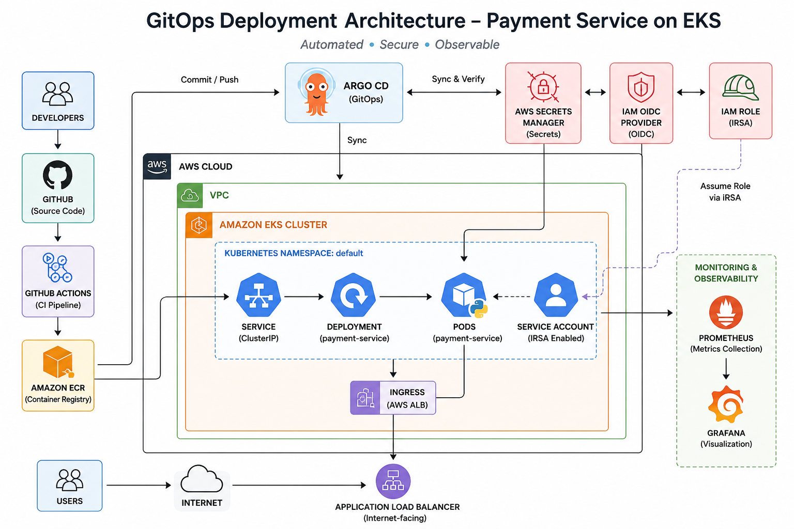

# EKS GitOps Payment Service



## Project Overview

This project demonstrates a complete GitOps-based deployment pipeline for a microservice called **payment-service** using Kubernetes, Helm, ArgoCD, Prometheus, and Grafana.

### Architecture

```text
GitHub
   ↓
ArgoCD
   ↓
Helm Chart
   ↓
Kind Kubernetes Cluster
   ↓
Payment Service
   ↓
NGINX Ingress

Monitoring:
Prometheus
   ↓
Grafana

Security:
Kubernetes Secret
ServiceAccount
```

## Features

- Helm Chart Deployment
- ArgoCD Auto Sync
- Kubernetes Secrets
- Service Account
- NGINX Ingress
- Prometheus Monitoring
- Grafana Dashboards
- Resource Requests and Limits
- GitOps Workflow

## Technologies Used

- Kubernetes (Kind)
- Docker
- Helm
- ArgoCD
- GitHub Actions
- Prometheus
- Grafana
- ServiceMonitor
- NGINX Ingress Controller
- Flask

## Author

**Nihal N**