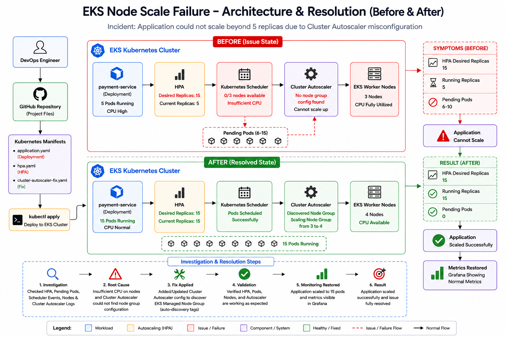

<div align="center">

# ☸️ EKS Node Scale Failure - Investigation & Resolution 




</div>

---

# 📂 Project Structure

| Folder           | Description                              |
| ---------------- | ---------------------------------------- |
| 📁 architecture  | Before & After architecture diagrams     |
| 📁 evidence      | Incident screenshots and command outputs |
| 📁 investigation | Root cause investigation report          |
| 📁 manifests     | Kubernetes manifests and fix             |
| 📄 README.md     | Complete project documentation           |
| 📄 validation.md | Validation report after applying the fix |

---

# 🧠 Project Overview

This project simulates a **real-world Amazon EKS production incident** where an application fails to scale even though the Horizontal Pod Autoscaler (HPA) requests additional replicas.

During the incident:

* The application experiences increased CPU utilization.
* HPA requests scaling from **5** to **15** replicas.
* Kubernetes attempts to schedule additional pods.
* Worker nodes have no remaining CPU resources.
* New pods remain in the **Pending** state.
* Cluster Autoscaler fails to provision additional worker nodes because it cannot discover the EKS Managed Node Group.

The objective of this project is to perform a structured production incident investigation, identify the root cause, implement the fix, validate the resolution, and document the entire troubleshooting process.

---

# 🚨 Incident Summary

## Incident

Application could not scale beyond **5 replicas**.

---

## Symptoms

```text
Desired Replicas : 15

Current Replicas : 5

Pending Pods

0/3 nodes available

Insufficient CPU
```

---

## Cluster Autoscaler Logs

```text
No node group config found
```

---

# 🎯 Project Objectives

This project answers the following production investigation questions:

* ✅ Is the Horizontal Pod Autoscaler working correctly?
* ✅ Are Kubernetes worker nodes healthy?
* ✅ Why are pods stuck in the Pending state?
* ✅ Why didn't Cluster Autoscaler provision additional nodes?
* ✅ What configuration caused the scaling failure?
* ✅ How can the issue be resolved?

---

# 🏗️ Architecture at a Glance

```text
                    High CPU Utilization
                            │
                            ▼
                  Horizontal Pod Autoscaler
                            │
                  Desired Replicas = 15
                            │
                            ▼
                  Kubernetes Scheduler
                            │
            ┌───────────────┴───────────────┐
            │                               │
            ▼                               ▼
 Existing Worker Nodes              Pending Pods
 CPU Fully Utilized             Cannot be Scheduled
            │                               │
            └───────────────┬───────────────┘
                            ▼
                  Cluster Autoscaler
                            │
            Node Group Discovery Failed
                            │
                            ▼
               No Additional Worker Nodes
                            │
                            ▼
                Application Cannot Scale
```

---

# 🔧 Technologies Used

| Layer              | Technology                | Purpose                     |
| ------------------ | ------------------------- | --------------------------- |
| ☁️ Cloud           | AWS EKS                   | Managed Kubernetes Cluster  |
| ☸️ Orchestration   | Kubernetes                | Container orchestration     |
| 📈 Autoscaling     | Horizontal Pod Autoscaler | Pod autoscaling             |
| 🖥️ Compute        | EKS Managed Node Group    | Worker nodes                |
| ⚙️ Autoscaling     | Cluster Autoscaler        | Automatic node provisioning |
| 🐳 Containers      | BusyBox                   | Demo workload               |
| 💻 CLI             | kubectl                   | Cluster management          |
| 📂 Version Control | GitHub                    | Project repository          |
| 📖 Documentation   | Markdown                  | Investigation reports       |

---

# 📁 Repository Structure

```text
EKS Node Scale Failure
│
├── architecture
│     └── architecture.png
│
├── evidence
│     ├── cluster-output.txt
│     ├── validation-output.txt
│     └── evidence.md
│
├── investigation
│     └── investigation.md
│
├── manifests
│     ├── application.yaml
│     ├── hpa.yaml
│     └── cluster-autoscaler-fix.yaml
│
├── README.md
└── validation.md
```

---

# ⚙️ Production Environment

| Component          | Configuration                                   |
| ------------------ | ----------------------------------------------- |
| Platform           | Amazon EKS                                      |
| Application        | payment-service                                 |
| Initial Replicas   | 5                                               |
| Maximum Replicas   | 15                                              |
| HPA Metric         | CPU Utilization                                 |
| Cluster Autoscaler | Enabled                                         |
| Worker Nodes       | 3                                               |
| Issue              | Cluster Autoscaler Node Group Discovery Failure |
---

# 🔍 Investigation Workflow

During the incident, a systematic troubleshooting approach was followed to isolate the root cause.

```text
User Reports Application Cannot Scale
                │
                ▼
        Verify HPA Configuration
                │
                ▼
      Verify Deployment Status
                │
                ▼
     Check Pending Pods & Events
                │
                ▼
      Inspect Worker Node Capacity
                │
                ▼
     Investigate Cluster Autoscaler
                │
                ▼
      Identify Root Cause
                │
                ▼
         Apply Configuration Fix
                │
                ▼
         Validate Application Scaling
```

---

# 🚨 Incident Investigation

## Step 1 — Verify Horizontal Pod Autoscaler

### Command

```bash
kubectl get hpa
```

Expected Production Output

```text
NAME                  REFERENCE                    TARGETS    MINPODS   MAXPODS   REPLICAS

payment-service-hpa   Deployment/payment-service   95%/50%    5         15        5
```

### Analysis

* Horizontal Pod Autoscaler detected high CPU utilization.
* Desired replica count increased from **5** to **15**.
* Current replicas remained at **5**.

### Investigation Result

✅ Horizontal Pod Autoscaler is functioning correctly.

---

# Step 2 — Verify Deployment

### Command

```bash
kubectl get deployment
```

Expected Output

```text
NAME              READY   UP-TO-DATE   AVAILABLE

payment-service   5/5     5            5
```

### Analysis

Deployment configuration is healthy.

No deployment failures were detected.

---

# Step 3 — Verify Pods

### Command

```bash
kubectl get pods
```

Expected Production Output

```text
payment-service-1     Running
payment-service-2     Running
payment-service-3     Running
payment-service-4     Running
payment-service-5     Running

payment-service-6     Pending
payment-service-7     Pending
payment-service-8     Pending
payment-service-9     Pending
payment-service-10    Pending
```

### Analysis

Existing replicas continue serving traffic.

Additional replicas remain in the **Pending** state.

---

# Step 4 — Scheduler Investigation

### Command

```bash
kubectl describe pod payment-service-6
```

Expected Production Output

```text
Warning  FailedScheduling

0/3 nodes available

Insufficient CPU
```

### Analysis

Kubernetes Scheduler attempted to place new pods but all worker nodes had exhausted their CPU resources.

Pods could not be scheduled.

---

# Step 5 — Worker Node Investigation

### Command

```bash
kubectl describe nodes
```

Observation

* Worker nodes are healthy.
* No node failures detected.
* CPU resources fully allocated.

Conclusion

Worker nodes require horizontal scaling.

---

# Step 6 — Cluster Autoscaler Investigation

### Command

```bash
kubectl logs deployment/cluster-autoscaler -n kube-system
```

Expected Output

```text
No node group config found
```

### Analysis

Cluster Autoscaler failed to discover the EKS Managed Node Group.

Without discovering the node group, it cannot provision additional EC2 worker nodes.

---

# 📸 Evidence Collected

| Investigation      | Result                        |
| ------------------ | ----------------------------- |
| HPA                | ✅ Working                     |
| Deployment         | ✅ Healthy                     |
| Scheduler          | ❌ Insufficient CPU            |
| Pending Pods       | ❌ Present                     |
| Worker Nodes       | ❌ Fully Utilized              |
| Cluster Autoscaler | ❌ Node Group Discovery Failed |

---

# 🧠 Root Cause Analysis

## What Happened?

The application experienced increased traffic which caused CPU utilization to exceed the configured HPA threshold.

The Horizontal Pod Autoscaler correctly attempted to scale the application from **5** replicas to **15** replicas.

However, Kubernetes Scheduler could not place the new pods because all worker nodes had exhausted their available CPU capacity.

Normally, Cluster Autoscaler would detect this condition and automatically provision additional EC2 worker nodes.

Instead, Cluster Autoscaler failed because it could not discover the configured Managed Node Group.

---

# Root Cause

The Cluster Autoscaler configuration was missing or contained an incorrect node group auto-discovery configuration.

As a result:

* Worker nodes were never added.
* Pending pods remained unscheduled.
* Application scaling stopped at 5 replicas.

---

# 🛠️ Fix Implementation

The issue was resolved by correcting the Cluster Autoscaler configuration.

Configuration added:

```yaml
--cloud-provider=aws

--cluster-name=my-eks-cluster

--node-group-auto-discovery=asg:tag=k8s.io/cluster-autoscaler/enabled,k8s.io/cluster-autoscaler/my-eks-cluster
```

---

# 📂 Manifest Files

## application.yaml

Deploys the payment-service application with CPU requests and limits.

---

## hpa.yaml

Creates a Horizontal Pod Autoscaler.

Configuration

* Minimum Replicas : 5
* Maximum Replicas : 15
* Target CPU : 50%

---

## cluster-autoscaler-fix.yaml

Corrects the Cluster Autoscaler configuration by enabling Managed Node Group auto-discovery.

After applying this configuration, Cluster Autoscaler successfully provisions new worker nodes whenever Kubernetes reports insufficient CPU resources.
---

# ✅ Validation

After correcting the Cluster Autoscaler configuration, the application was successfully able to scale according to demand.

---

## Validation Step 1 — Horizontal Pod Autoscaler

### Command

```bash
kubectl get hpa
```

Expected Output

```text
NAME                  REFERENCE                    TARGETS   MINPODS   MAXPODS   REPLICAS

payment-service-hpa   Deployment/payment-service   48%/50%   5         15        15
```

Result

✅ HPA successfully scaled the application to **15 replicas**.

---

## Validation Step 2 — Worker Nodes

### Command

```bash
kubectl get nodes
```

Expected Output

```text
ip-10-0-1-25     Ready
ip-10-0-2-41     Ready
ip-10-0-3-18     Ready
ip-10-0-4-62     Ready
```

Result

✅ Cluster Autoscaler provisioned an additional worker node.

---

## Validation Step 3 — Application Pods

### Command

```bash
kubectl get pods
```

Expected Output

```text
payment-service-1      Running
payment-service-2      Running
payment-service-3      Running
payment-service-4      Running
payment-service-5      Running
payment-service-6      Running
payment-service-7      Running
payment-service-8      Running
payment-service-9      Running
payment-service-10     Running
payment-service-11     Running
payment-service-12     Running
payment-service-13     Running
payment-service-14     Running
payment-service-15     Running
```

Result

✅ All application pods are running successfully.

---

## Validation Step 4 — Cluster Autoscaler

### Command

```bash
kubectl logs deployment/cluster-autoscaler -n kube-system
```

Expected Output

```text
Successfully discovered node group

Scaling node group from 3 to 4 nodes

Scale-up completed successfully.
```

Result

✅ Cluster Autoscaler is functioning correctly.

---

# 📊 Before vs After

| Component          | Before Fix                  | After Fix                          |
| ------------------ | --------------------------- | ---------------------------------- |
| HPA                | Requested 15 replicas       | Successfully scaled to 15 replicas |
| Worker Nodes       | Fully utilized              | Additional node provisioned        |
| Pending Pods       | Present                     | None                               |
| Scheduler          | Insufficient CPU            | Successfully scheduled pods        |
| Cluster Autoscaler | Node group discovery failed | Node group discovered successfully |
| Application        | Unable to scale             | Successfully scaled                |

---

# 🎯 Key Learnings

This project demonstrates several important production Kubernetes concepts:

* Understanding Horizontal Pod Autoscaler (HPA)
* Kubernetes Scheduler behavior
* Resource requests and CPU allocation
* Pending pod investigation
* Node capacity analysis
* Amazon EKS Managed Node Groups
* Cluster Autoscaler architecture
* Auto-discovery configuration
* Production incident troubleshooting
* Root cause analysis
* Validation after remediation
* Documentation of production incidents

---

<div align="center">

# 👨‍💻 Author

## **NIHAL N**

**DevOps | Cloud | Kubernetes | AWS | DevSecOps**

[](https://www.linkedin.com/in/nihal-n-cse/)

⭐ **If this project helped you understand Kubernetes autoscaling and production incident response, consider giving the repository a star!**


</div>

---