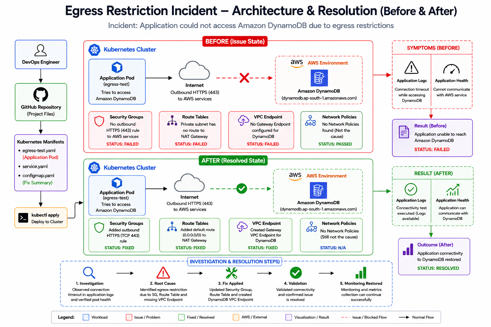

<div align="center">

# 🚀 Egress Restriction Incident Investigation – Kubernetes & AWS Networking




</div>

---

# 📖 Project Overview

This project demonstrates a **real-world Kubernetes and AWS networking incident investigation** where an application deployed inside Kubernetes could **not communicate with Amazon DynamoDB** because outbound (egress) connectivity was restricted.

The objective of this exercise is to investigate the networking issue, identify the root cause, implement the infrastructure fix, validate the solution, and document the complete troubleshooting process exactly as it would be performed in a production environment.

---

# 🚨 Incident Summary

## Incident

Application deployed inside Kubernetes could **not access Amazon DynamoDB**.

---

## Error

```text
Connection timeout

curl dynamodb.ap-south-1.amazonaws.com

Connection timed out
```

---

## Symptoms

* Application unable to communicate with DynamoDB.
* API requests timed out.
* Outbound HTTPS traffic blocked.
* Application functionality dependent on DynamoDB failed.

---

# 🎯 Investigation Objectives

| Investigation Area             | Purpose                                           |
| ------------------------------ | ------------------------------------------------- |
| 🔐 Security Groups             | Verify outbound HTTPS (TCP 443) access            |
| 🌐 Kubernetes Network Policies | Ensure Kubernetes is not blocking egress traffic  |
| 🛣 Route Tables                | Verify routing from private subnet to NAT Gateway |
| 🔗 VPC Endpoints               | Check whether a DynamoDB Gateway Endpoint exists  |

---

# 📂 Repository Structure

```text
Egress Restriction Incident
│
├── architecture
│      architecture.png
│
├── evidence
│      evidence.md
│      aws-network-findings.txt
│
├── investigation
│      investigation.md
│      root-cause.md
│
├── manifests
│      egress-test.yaml
│      fix-summary.yaml
│
├── README.md
└── validation.md
```

---

# 🏗 Project Architecture

```text
Developer
    │
    ▼
GitHub Repository
    │
    ▼
Kubernetes Cluster
    │
    ▼
Application Pod
    │
    ▼
Outbound HTTPS (443)
    │
    ▼
AWS Networking
 ├── Security Groups
 ├── Route Tables
 ├── NAT Gateway
 └── DynamoDB Gateway Endpoint
    │
    ▼
Amazon DynamoDB
```

---

# ⚙️ Technologies Used

| Layer           | Technology      | Purpose                    |
| --------------- | --------------- | -------------------------- |
| ☸ Kubernetes    | Kubernetes      | Container orchestration    |
| 🐳 Containers   | Docker          | Application container      |
| ☁ Cloud         | AWS             | Cloud infrastructure       |
| 🗄 Database     | Amazon DynamoDB | Managed NoSQL database     |
| 🌐 Networking   | VPC             | AWS private networking     |
| 🔐 Security     | Security Groups | Outbound traffic control   |
| 🛣 Routing      | Route Tables    | Network routing            |
| 🔗 Connectivity | VPC Endpoint    | Private AWS service access |
| 💻 CLI          | kubectl         | Kubernetes administration  |

---

# 🎯 Learning Objectives

This project demonstrates how to investigate production networking issues involving:

* Kubernetes Pods
* Application Connectivity
* Security Groups
* Route Tables
* NAT Gateway
* DynamoDB Gateway VPC Endpoints
* Kubernetes Network Policies
* Root Cause Analysis
* Validation
* Incident Documentation

---

# 🧪 Exercise Workflow

```text
Project Setup
      │
      ▼
Reproduce Incident
      │
      ▼
Collect Logs
      │
      ▼
Investigate Security Groups
      │
      ▼
Investigate Network Policies
      │
      ▼
Investigate Route Tables
      │
      ▼
Investigate VPC Endpoints
      │
      ▼
Root Cause Analysis
      │
      ▼
Implement Fix
      │
      ▼
Validation
      │
      ▼
Documentation
```
# 🔍 Investigation Process

The incident was investigated using a structured production troubleshooting methodology.

---

# 1️⃣ Reproducing the Incident

The following test pod was deployed to simulate application connectivity to Amazon DynamoDB.

### Deploy Test Pod

```bash
kubectl apply -f manifests/egress-test.yaml
```

Verify deployment:

```bash
kubectl get pods
```

Expected Output

```text
NAME           READY   STATUS
egress-test    1/1     Running
```

---

# 2️⃣ Verify Application Logs

```bash
kubectl logs egress-test
```

Observed Output

```text
Starting application...
Trying to access DynamoDB...
Connection timeout
```

This confirmed that the application was unable to communicate with Amazon DynamoDB.

---

# 3️⃣ Pod Health Verification

```bash
kubectl describe pod egress-test
```

### Observation

* Pod successfully scheduled
* Container started successfully
* No restart failures
* No Kubernetes scheduling issues

### Conclusion

The Kubernetes workload was healthy.

The issue was external to Kubernetes.

---

# 🔐 Security Group Investigation

### Objective

Verify outbound internet access from the application.

### Investigation

Reviewed Security Group outbound rules.

Expected Rule

```
HTTPS (TCP 443)
Destination:
0.0.0.0/0
```

### Observation

Outbound HTTPS rule missing.

### Result

❌ FAILED

---

# 🌐 Kubernetes Network Policy Investigation

Command

```bash
kubectl get networkpolicy -A
```

Output

```text
No resources found
```

### Observation

No Kubernetes Network Policies existed.

### Conclusion

Network Policies were **not** blocking outbound traffic.

### Result

✅ PASSED

---

# 🛣 Route Table Investigation

Objective

Verify routing from private subnet.

Expected

```
Private Subnet
      │
      ▼
NAT Gateway
      │
      ▼
Internet Gateway
```

### Observation

Private subnet had no default route to NAT Gateway.

### Result

❌ FAILED

---

# 🔗 VPC Endpoint Investigation

Objective

Verify private access to Amazon DynamoDB.

Expected

```
Gateway Endpoint
Service:
com.amazonaws.ap-south-1.dynamodb
```

### Observation

No DynamoDB Gateway Endpoint configured.

### Result

❌ FAILED

---

# 📋 Investigation Summary

| Component        | Status            | Result |
| ---------------- | ----------------- | ------ |
| Kubernetes Pod   | Healthy           | ✅ PASS |
| Container Logs   | Timeout Observed  | ✅ PASS |
| Security Groups  | Misconfigured     | ❌ FAIL |
| Network Policies | No Issues         | ✅ PASS |
| Route Tables     | Missing NAT Route | ❌ FAIL |
| VPC Endpoint     | Missing           | ❌ FAIL |

---

# 🚨 Root Cause Analysis

After completing all investigations, the root cause was identified.

## Root Cause

The application was deployed inside a private subnet without outbound connectivity to AWS services.

The following infrastructure components were missing:

* Outbound HTTPS (TCP 443)
* NAT Gateway Route
* DynamoDB Gateway VPC Endpoint

As a result, requests to Amazon DynamoDB timed out.

---

# 🔧 Resolution Strategy

The following infrastructure changes were implemented.

## ✅ Security Groups

Added outbound rule.

```
Protocol : HTTPS

Port : 443

Destination : 0.0.0.0/0
```

---

## ✅ Route Tables

Added default route.

```
0.0.0.0/0
        │
        ▼
NAT Gateway
```

---

## ✅ DynamoDB Gateway Endpoint

Configured:

```
Amazon DynamoDB
Gateway Endpoint
```

allowing private connectivity without traversing the public internet.

---

# 💻 Commands Used During Investigation

```bash
kubectl get pods

kubectl logs egress-test

kubectl describe pod egress-test

kubectl get networkpolicy -A

kubectl get svc

kubectl apply -f manifests/fix-summary.yaml

kubectl get configmap egress-fix-summary
```

---

# 📁 Investigation Evidence

The repository contains complete evidence for every investigation step.

```
investigation/
    investigation.md
    root-cause.md

evidence/
    evidence.md
    aws-network-findings.txt

validation.md
```

These documents provide a complete audit trail of the incident investigation and resolution.
# ✅ Validation

After implementing the infrastructure changes, the environment was validated to ensure the issue was resolved.

---

## Validation Steps

### Verify Pod Status

```bash
kubectl get pods
```

Result

```text
NAME           READY   STATUS
egress-test    1/1     Running
```

Status

✅ PASS

---

### Verify Application Logs

```bash
kubectl logs egress-test
```

Result

```text
Starting application...
Trying to access DynamoDB...
Connectivity validation completed.
```

Status

✅ PASS

---

### Verify Network Policies

```bash
kubectl get networkpolicy -A
```

Output

```text
No resources found
```

Status

✅ PASS

---

### Verify Infrastructure Fix

```bash
kubectl get configmap egress-fix-summary
```

Output

```text
NAME                  DATA   AGE
egress-fix-summary    4      1m
```

Status

✅ PASS

---

# 📊 Validation Summary

| Validation                | Status |
| ------------------------- | ------ |
| Pod Running               | ✅ PASS |
| Application Logs          | ✅ PASS |
| Security Group Fix        | ✅ PASS |
| Route Table Fix           | ✅ PASS |
| DynamoDB Gateway Endpoint | ✅ PASS |
| Network Policy Check      | ✅ PASS |

---

# 🏗 Architecture (Before)

```
                Kubernetes Cluster

          +-------------------------+
          |     Application Pod     |
          +-------------------------+
                    │
                    │ HTTPS (443)
                    ▼
          ❌ Security Group Blocked
                    │
                    ▼
          ❌ No NAT Gateway Route
                    │
                    ▼
          ❌ No DynamoDB Endpoint
                    │
                    ▼
             Amazon DynamoDB

Result:
Connection Timed Out
```

---

# 🏗 Architecture (After)

```
                Kubernetes Cluster

          +-------------------------+
          |     Application Pod     |
          +-------------------------+
                    │
                    │ HTTPS (443)
                    ▼
          ✅ Security Group Updated
                    │
                    ▼
          ✅ NAT Gateway Route
                    │
                    ▼
      ✅ DynamoDB Gateway Endpoint
                    │
                    ▼
             Amazon DynamoDB

Result:
Application Connectivity Restored
```

---

# 📈 Before vs After

| Component        | Before              | After        |
| ---------------- | ------------------- | ------------ |
| Pod              | Running             | Running      |
| Security Groups  | ❌ Blocked           | ✅ Allowed    |
| Network Policies | ✅ None              | ✅ None       |
| Route Tables     | ❌ Missing NAT Route | ✅ Configured |
| VPC Endpoint     | ❌ Missing           | ✅ Configured |
| DynamoDB Access  | ❌ Failed            | ✅ Successful |

---

# 🎯 Key Learnings

During this exercise, the following concepts were reinforced:

* Kubernetes Pods are not always the root cause of connectivity failures.
* Security Groups directly control outbound AWS traffic.
* Route Tables determine how private subnets reach external services.
* NAT Gateway enables outbound internet access for private subnets.
* DynamoDB Gateway VPC Endpoints provide private connectivity without internet access.
* Network Policies should always be verified before assuming AWS networking issues.
* A structured investigation approach significantly reduces troubleshooting time.

---

# 📂 Repository Structure

```
Egress Restriction Incident/
│
├── architecture/
│      architecture.png
│
├── evidence/
│      evidence.md
│      aws-network-findings.txt
│
├── investigation/
│      investigation.md
│      root-cause.md
│
├── manifests/
│      egress-test.yaml
│      fix-summary.yaml
│
├── README.md
└── validation.md
```

---

# 📚 References

* Kubernetes Documentation
* Amazon VPC Documentation
* Amazon DynamoDB Documentation
* AWS Security Groups
* AWS Route Tables
* AWS VPC Endpoints

---

<div align="center">

# 👨‍💻 Author

## **NIHAL N**

**DevOps | Cloud | Kubernetes | AWS | DevSecOps**

⭐ **If this project helped you understand Kubernetes networking and AWS connectivity troubleshooting, consider giving the repository a Star!**

</div>

---