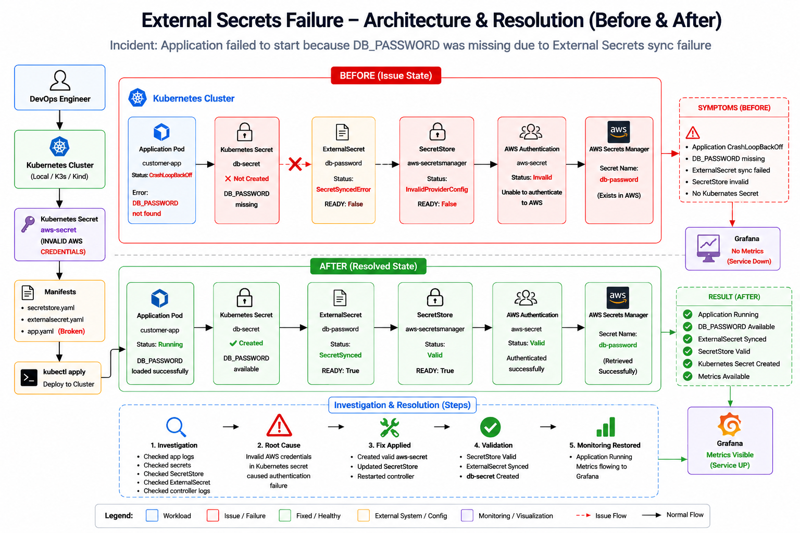

<div align="center">

# 🔐 External Secrets Failure Investigation & Resolution




</div>

---

# 📌 Incident Summary

This project demonstrates a real-world Kubernetes troubleshooting scenario involving **External Secrets Operator**, **AWS Secrets Manager**, and application startup failures.

The application failed during startup because the required environment variable:

```text
DB_PASSWORD
```

was not available inside the pod.

Investigation revealed that External Secrets was unable to authenticate with AWS Secrets Manager, preventing secret synchronization and causing the application to enter a CrashLoopBackOff state.

---

# 🚨 Incident Details

### Application Logs

```text
FATAL:
Database password not found
Environment Variable DB_PASSWORD missing
```

### Pod Status

```text
customer-app   CrashLoopBackOff
```

### SecretStore Status

```text
aws-secretsmanager

STATUS: InvalidProviderConfig
READY : False
```

### ExternalSecret Status

```text
SecretSyncedError
READY=False
```

---

# 📂 Repository Structure

```text
External-Secrets-Failure
│
├── Architecture
│   ├── before.txt
│   └── after.txt
│
├── evidence
│   └── evidence.md
│
├── investigation
│   └── investigation.md
│
├── manifests
│   ├── app.yaml
│   ├── app-fixed.yaml
│   ├── aws-secret.yaml
│   ├── secretstore.yaml
│   ├── secretstore-fixed.yaml
│   └── externalsecret.yaml
│
├── validation.md
└── README.md
```

---

# 🏗️ Architecture Overview

## Before Fix

```text
customer-app
     │
     ▼
DB_PASSWORD Missing
     │
     ▼
Kubernetes Secret Missing
     │
     ▼
ExternalSecret Sync Failed
     │
     ▼
SecretStore Invalid
     │
     ▼
AWS Authentication Failure
     │
     ▼
AWS Secrets Manager
```

Result:

```text
Application CrashLoopBackOff
```

---

## After Fix

```text
customer-app
     │
     ▼
DB_PASSWORD Available
     │
     ▼
Kubernetes Secret Created
     │
     ▼
ExternalSecret Synced
     │
     ▼
SecretStore Valid
     │
     ▼
AWS Authentication Successful
     │
     ▼
AWS Secrets Manager
```

Result:

```text
Application Running
```

---

# 🔍 Investigation Process

## Step 1 — Verify Application Failure

Command:

```bash
kubectl logs customer-app
```

Output:

```text
FATAL:
Database password not found
Environment Variable DB_PASSWORD missing
```

Finding:

Application failed because DB_PASSWORD was unavailable.

---

## Step 2 — Verify Kubernetes Secret

Command:

```bash
kubectl get secrets
```

Output:

```text
No resources found
```

Finding:

Required Kubernetes Secret was missing.

---

## Step 3 — Investigate SecretStore

Command:

```bash
kubectl describe secretstore aws-secretsmanager
```

Finding:

```text
InvalidProviderConfig
```

```text
failed to refresh cached credentials
```

```text
no EC2 IMDS role found
```

---

## Step 4 — Investigate Controller Logs

Command:

```bash
kubectl logs -n external-secrets deployment/external-secrets
```

Finding:

```text
unable to validate store
```

```text
failed to refresh cached credentials
```

---

## Step 5 — Investigate ExternalSecret

Command:

```bash
kubectl describe externalsecret db-password
```

Finding:

```text
UnrecognizedClientException
```

```text
The security token included in the request is invalid
```

---

# 🎯 Root Cause Analysis

The External Secrets Operator could not authenticate to AWS Secrets Manager.

This caused:

```text
AWS Authentication Failure
        ↓
SecretStore InvalidProviderConfig
        ↓
ExternalSecret Sync Failure
        ↓
Kubernetes Secret Missing
        ↓
DB_PASSWORD Missing
        ↓
Application CrashLoopBackOff
```

---

# 🔧 Fix Implementation

## Fix 1

Created secret in AWS Secrets Manager.

```bash
aws secretsmanager create-secret \
--name db-password \
--secret-string "SuperSecret123!"
```

---

## Fix 2

Created Kubernetes Secret containing AWS credentials.

```bash
kubectl create secret generic aws-secret
```

---

## Fix 3

Updated SecretStore authentication configuration.

File:

```text
secretstore-fixed.yaml
```

---

## Fix 4

Created ExternalSecret.

File:

```text
externalsecret.yaml
```

---

## Fix 5

Updated application to consume DB_PASSWORD.

File:

```text
app-fixed.yaml
```

---

# ✅ Validation

## SecretStore

```bash
kubectl get secretstore
```

Result:

```text
READY=True
STATUS=Valid
```

---

## ExternalSecret

```bash
kubectl get externalsecret
```

Result:

```text
READY=True
STATUS=SecretSynced
```

---

## Kubernetes Secret

```bash
kubectl get secret db-secret
```

Result:

```text
db-secret created
```

---

## Application

```bash
kubectl get pods
```

Result:

```text
customer-app 1/1 Running
```

---

## Application Logs

```bash
kubectl logs customer-app
```

Result:

```text
Database password loaded successfully
Application started
```

---

# 📊 Before vs After

| Component         | Before                | After        |
| ----------------- | --------------------- | ------------ |
| SecretStore       | InvalidProviderConfig | Valid        |
| ExternalSecret    | SecretSyncedError     | SecretSynced |
| Kubernetes Secret | Missing               | Created      |
| DB_PASSWORD       | Missing               | Available    |
| Application       | CrashLoopBackOff      | Running      |

---

# 🧠 Key Learnings

* External Secrets Operator requires valid AWS authentication.
* SecretStore health must be verified before troubleshooting applications.
* ExternalSecret failures often indicate upstream authentication or permissions issues.
* Missing Kubernetes Secrets can cause application startup failures.
* Investigation should always follow a dependency chain rather than assumptions.

---

<div align="center">

## 👨‍💻 Author

**NIHAL N** 

DevOps & Cloud Engineer

⭐ If this project helped you understand External Secrets troubleshooting, consider giving it a star.

</div>

---