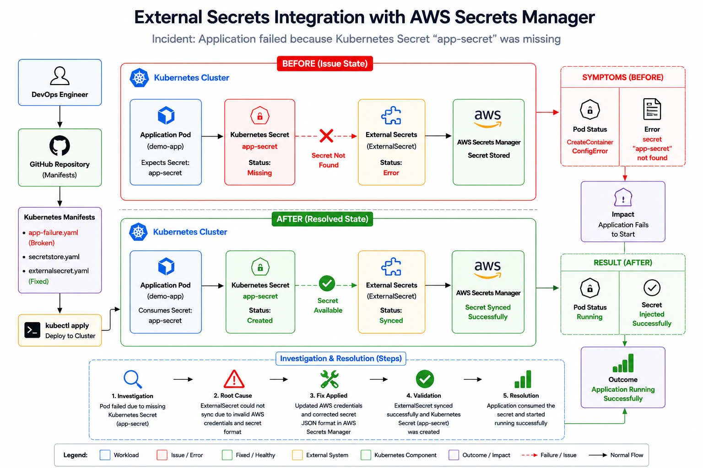

<div align="center">

# 🔐 External Secrets Integration with AWS Secrets Manager




</div>

---

# 📖 Project Overview

This project demonstrates how to securely integrate **AWS Secrets Manager** with **Kubernetes** using the **External Secrets Operator (ESO)**.

Instead of manually creating Kubernetes Secrets, sensitive credentials are stored securely inside **AWS Secrets Manager**. The External Secrets Operator continuously synchronizes these secrets into Kubernetes, allowing applications to consume them without exposing sensitive data inside Git repositories.

During this exercise, an application failed because the required Kubernetes Secret (`app-secret`) did not exist. The issue was investigated from the pod level through AWS authentication, SecretStore configuration, ExternalSecret synchronization, and secret formatting. After correcting the AWS credentials and storing the secret in valid JSON format, the External Secrets Operator successfully synchronized the secret, allowing the application to start successfully.

---

# 📂 Project Directory Structure

```text
External Secrets Integration
│
├── Architecture/
│   └── architecture-before-after.png
│
├── evidence/
│   └── evidence.md
│
├── investigation/
│   └── investigation.md
│
├── manifests/
│   ├── app-failure.yaml
│   ├── app-fixed.yaml
│   ├── secretstore.yaml
│   └── externalsecret.yaml
│
├── validation.md
└── README.md
```

---

# 🚨 Incident Summary

## Incident

The application failed to start because it expected a Kubernetes Secret named **`app-secret`**, but the secret did not exist inside the Kubernetes cluster.

Although the External Secrets Operator had been installed and configured, it failed to synchronize the secret from AWS Secrets Manager due to authentication issues and an incorrectly formatted secret stored in AWS.

As a result, Kubernetes was unable to inject the required environment variables into the application container.

---

# ❌ Problem Statement

The application required the following secrets:

- DB_USERNAME
- DB_PASSWORD
- JWT_SECRET

These values were expected to be automatically synchronized from **AWS Secrets Manager** into a Kubernetes Secret named:

```text
app-secret
```

However, the synchronization failed, causing the application deployment to fail.

---

# ⚠️ Initial Symptoms


| Component | Status |
|------------|---------|
| Application Pod | CreateContainerConfigError |
| Kubernetes Secret | Missing |
| ExternalSecret | SecretSyncedError |
| SecretStore | Ready |
| AWS Secret | Present |
| Application | Failed to Start |

---

# 🔍 Initial Error Messages

### Pod Events

```text
Error: secret "app-secret" not found
```

---

### External Secret

```text
STATUS : SecretSyncedError
READY  : False
```

---

### AWS Authentication Error

```text
UnrecognizedClientException
The security token included in the request is invalid.
```

Later during troubleshooting:

```text
InvalidSignatureException
The request signature we calculated does not match the signature you provided.
```

---

# 🏗️ Architecture Overview

The project uses **AWS Secrets Manager** as the central secret store.

The **External Secrets Operator** continuously synchronizes secrets into Kubernetes.

Applications consume only Kubernetes Secrets and never communicate directly with AWS.

---

## Architecture Flow

```text
                 AWS Cloud
          ┌──────────────────────┐
          │ AWS Secrets Manager  │
          │                      │
          │  DB_USERNAME         │
          │  DB_PASSWORD         │
          │  JWT_SECRET          │
          └──────────┬───────────┘
                     │
                     │
             External Secrets
                Operator (ESO)
                     │
                     ▼
          Kubernetes Secret
              app-secret
                     │
                     ▼
          Application Pod
              (demo-app)
                     │
                     ▼
      Reads Environment Variables
```

---

# ❌ Before Fix (Failure Workflow)

```text
AWS Secrets Manager
        │
        ▼
ExternalSecret
        │
        ▼
Authentication Failed
        │
        ▼
Secret Not Synced
        │
        ▼
app-secret Missing
        │
        ▼
CreateContainerConfigError
        │
        ▼
Application Failed
```

---

# ✅ After Fix (Resolved Workflow)

```text
AWS Secrets Manager
        │
        ▼
External Secrets Operator
        │
        ▼
SecretStore Authentication Success
        │
        ▼
ExternalSecret Synced
        │
        ▼
Kubernetes Secret Created
        │
        ▼
demo-app Reads Secret
        │
        ▼
Application Started Successfully
```

---

# 🎯 Expected End Result

After successful implementation:

- ✅ AWS Secrets Manager securely stores all secrets.
- ✅ External Secrets Operator authenticates with AWS.
- ✅ SecretStore validates successfully.
- ✅ ExternalSecret synchronizes automatically.
- ✅ Kubernetes Secret (`app-secret`) is created.
- ✅ Application consumes secrets securely.
- ✅ No manual Kubernetes Secret creation is required.
---

# ⚙️ Implementation Guide


# Step 1 — Install External Secrets Operator

The External Secrets Operator (ESO) is responsible for synchronizing secrets from AWS Secrets Manager into Kubernetes.

### Add Helm Repository

```bash
helm repo add external-secrets https://charts.external-secrets.io
helm repo update
```

### Install the Operator

```bash
helm install external-secrets external-secrets/external-secrets \
-n external-secrets \
--create-namespace
```

### Verify Installation

```bash
kubectl get pods -n external-secrets
```

Expected:

```text
external-secrets                         Running
external-secrets-cert-controller         Running
external-secrets-webhook                 Running
```

---

# Step 2 — Create Secrets in AWS Secrets Manager

Store the following sensitive values securely inside AWS Secrets Manager.

| Secret Property | Value |
|----------------|-------|
| DB_USERNAME | admin |
| DB_PASSWORD | Password@123 |
| JWT_SECRET | jwt-secret-123 |

The secret was created with the name:

```text
app-secret
```

The final secret was stored in valid JSON format.

```json
{
  "DB_USERNAME": "admin",
  "DB_PASSWORD": "Password@123",
  "JWT_SECRET": "jwt-secret-123"
}
```

Verify the secret:

```bash
aws secretsmanager get-secret-value \
--secret-id app-secret
```

---

# Step 3 — Configure AWS Authentication

The External Secrets Operator authenticates with AWS using IAM credentials stored inside a Kubernetes Secret.

Create the Kubernetes Secret:

```bash
kubectl create secret generic aws-secret \
--from-literal=access-key=<AWS_ACCESS_KEY_ID> \
--from-literal=secret-access-key=<AWS_SECRET_ACCESS_KEY>
```

Verify:

```bash
kubectl get secret aws-secret
```

Expected:

```text
aws-secret   Opaque   2
```

---

# Step 4 — Configure SecretStore

The SecretStore connects Kubernetes to AWS Secrets Manager.

Apply:

```bash
kubectl apply -f manifests/secretstore.yaml
```

Verify:

```bash
kubectl get secretstore
```

Expected:

```text
READY   True
```

---

# Step 5 — Create ExternalSecret

Create the ExternalSecret resource.

```bash
kubectl apply -f manifests/externalsecret.yaml
```

Verify:

```bash
kubectl get externalsecret
```

Expected:

```text
STATUS   SecretSynced
READY    True
```

---

# Step 6 — Deploy the Application

Deploy the application.

Failure Version

```bash
kubectl apply -f manifests/app-failure.yaml
```

Application Status

```bash
kubectl get pods
```

Observed:

```text
demo-app   CreateContainerConfigError
```

Reason:

```text
secret "app-secret" not found
```

---

# Step 7 — Investigation

The following components were investigated:

- Kubernetes Pod
- Kubernetes Secret
- External Secrets Operator
- SecretStore
- ExternalSecret
- AWS Credentials
- AWS Secrets Manager
- Secret Format

The investigation identified multiple issues before reaching the final root cause.

---

# Step 8 — Root Cause

The synchronization failed due to two independent problems.

### Issue 1

Incorrect AWS IAM credentials stored inside:

```text
aws-secret
```

Result:

```text
InvalidSignatureException
```

---

### Issue 2

AWS Secret stored in an invalid format.

Incorrect:

```text
{DB_USERNAME:admin,DB_PASSWORD:Password@123,JWT_SECRET:jwt-secret-123}
```

Correct:

```json
{
  "DB_USERNAME": "admin",
  "DB_PASSWORD": "Password@123",
  "JWT_SECRET": "jwt-secret-123"
}
```

Because of the invalid structure, External Secrets could not extract the individual properties.

---

# Step 9 — Fix Implementation

The following fixes were applied.

✅ Recreated IAM credentials

✅ Updated Kubernetes `aws-secret`

✅ Corrected AWS Secrets Manager secret format

✅ Forced ExternalSecret synchronization

```bash
kubectl annotate externalsecret app-secret force-sync=<timestamp> --overwrite
```

Verification:

```bash
kubectl get externalsecret
```

Output:

```text
STATUS   SecretSynced
READY    True
```

---

# ✅ Validation

The implementation was validated using the following commands.

---

## 1. External Secrets Operator Validation

```bash
kubectl get pods -n external-secrets
```

Expected Result

```text
external-secrets                     Running
external-secrets-webhook             Running
external-secrets-cert-controller     Running
```

Status

✅ PASS

---

## 2. SecretStore Validation

```bash
kubectl get secretstore
```

Expected

```text
NAME               READY
aws-secret-store   True
```

Status

✅ PASS

---

## 3. ExternalSecret Validation

```bash
kubectl get externalsecret
```

Expected

```text
STATUS    SecretSynced
READY     True
```

Status

✅ PASS

---

## 4. Kubernetes Secret Validation

```bash
kubectl get secret app-secret
```

Expected

```text
app-secret   Opaque   3
```

Status

✅ PASS

---

## 5. Application Validation

```bash
kubectl get pods
```

Expected

```text
demo-app    1/1    Running
```

Status

✅ PASS

---

## 6. Runtime Validation

```bash
kubectl logs demo-app
```

Output

```text
Starting Application...
Reading Kubernetes Secret...
DB_USERNAME=admin
Application Started Successfully
```

Status

✅ PASS

---

# 📋 Commands Used

## Kubernetes

```bash
kubectl get pods
kubectl describe pod demo-app
kubectl logs demo-app

kubectl get secret
kubectl get secret app-secret
kubectl get secretstore
kubectl get externalsecret

kubectl apply -f manifests/app-failure.yaml
kubectl apply -f manifests/app-fixed.yaml
kubectl apply -f manifests/secretstore.yaml
kubectl apply -f manifests/externalsecret.yaml

kubectl delete pod demo-app

kubectl rollout restart deployment external-secrets -n external-secrets

kubectl annotate externalsecret app-secret force-sync=<timestamp> --overwrite
```

---

## AWS CLI

```bash
aws sts get-caller-identity

aws secretsmanager create-secret

aws secretsmanager update-secret

aws secretsmanager get-secret-value

aws iam create-user

aws iam attach-user-policy

aws iam create-access-key
```

---

# 🎯 Key Learnings

During this project the following concepts were learned:

- AWS Secrets Manager fundamentals
- External Secrets Operator architecture
- SecretStore configuration
- ExternalSecret synchronization
- Kubernetes Secret injection
- IAM authentication
- AWS Signature validation
- Secret formatting requirements
- Kubernetes troubleshooting methodology
- Production-ready secret management

---

<div align="center">

# 👨‍💻 Author

## **NIHAL N**

**DevOps | Cloud | Kubernetes | AWS**

[](https://www.linkedin.com/in/nihal-n-cse/)

---

**If this project helped you understand External Secrets, consider giving the repository a Star!**

</div>
