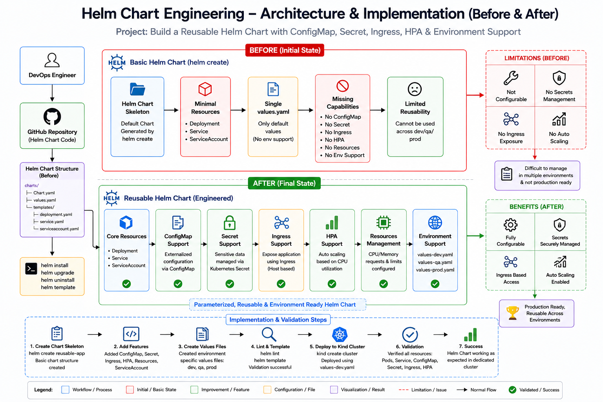

<div align="center">

# 📦 Helm Chart Engineering – Reusable Kubernetes Deployment 




</div>

---

# 📂 Project Structure

```text
Helm Chart Engineering/
│
├── Architecture/
│   └── arch.png
│
├── templates/
│   ├── _helpers.tpl
│   ├── configmap.yaml
│   ├── deployment.yaml
│   ├── hpa.yaml
│   ├── ingress.yaml
│   ├── secret.yaml
│   ├── service.yaml
│   └── serviceaccount.yaml
│
├── .helmignore
├── Chart.yaml
├── values.yaml
├── values-dev.yaml
├── values-qa.yaml
├── values-prod.yaml
│
├── investigation.md
├── evidence.md
├── validation.md
└── README.md
```

---
## 📁 Directory Description

| File / Folder | Description |
|---------------|-------------|
| 📁 **Architecture** | Contains the project architecture diagram (Before & After implementation). |
| 📁 **templates** | Helm templates used to generate Kubernetes resources dynamically. |
| 📄 **Chart.yaml** | Helm chart metadata including chart name, version and application version. |
| 📄 **values.yaml** | Default configuration shared across all environments. |
| 📄 **values-dev.yaml** | Development environment configuration. |
| 📄 **values-qa.yaml** | QA environment configuration. |
| 📄 **values-prod.yaml** | Production environment configuration. |
| 📄 **.helmignore** | Files ignored while packaging the Helm chart. |
| 📄 **investigation.md** | Engineering investigation and implementation report. |
| 📄 **evidence.md** | Validation evidence collected during implementation. |
| 📄 **validation.md** | Deployment and runtime validation results. |
| 📄 **README.md** | Complete project documentation. |

---

# 🎯 Project Objectives

This project was designed to achieve the following objectives:

- Build a reusable Helm Chart from scratch
- Create configurable Kubernetes templates
- Support multiple deployment environments
- Externalize application configuration
- Secure sensitive data using Kubernetes Secrets
- Enable Horizontal Pod Autoscaling (HPA)
- Configure Kubernetes Ingress
- Validate templates using Helm Lint
- Render Kubernetes manifests using Helm Template
- Deploy and validate the application on a dedicated Kind Kubernetes Cluster
- Follow production-grade Helm Chart engineering best practices

---

# 🏗️ Architecture at a Glance

```
                         Developer
                             │
                             ▼
                    GitHub Repository
                             │
                             ▼
                      Helm Chart Project
                             │
        ┌────────────────────┼────────────────────┐
        │                    │                    │
        ▼                    ▼                    ▼
   values-dev.yaml     values-qa.yaml     values-prod.yaml
        │                    │                    │
        └────────────────────┼────────────────────┘
                             │
                             ▼
                     Helm Template Engine
                             │
        ┌────────────────────┼─────────────────────────────┐
        │                    │                             │
        ▼                    ▼                             ▼
  Deployment.yaml      Service.yaml              ConfigMap.yaml
        │                    │                             │
        ├──────────────┐     │                             │
        ▼              ▼     ▼                             ▼
 Secret.yaml      Ingress.yaml      HPA.yaml      ServiceAccount.yaml
        │              │              │                  │
        └──────────────┴──────────────┴──────────────────┘
                             │
                             ▼
                     Helm Rendered Manifests
                             │
                             ▼
                     Helm Install Command
                             │
                             ▼
                  Kind Kubernetes Cluster
                             │
                             ▼
                  Kubernetes API Server
                             │
        ┌────────────────────┼────────────────────┐
        │                    │                    │
        ▼                    ▼                    ▼
   Deployment           ConfigMap             Secret
        │
        ▼
      ReplicaSet
        │
        ▼
        Pod
        │
        ▼
     Kubernetes Service
        │
        ▼
      Application Running
```

---

# 🔧 Technology Stack

| Layer | Tool | Purpose |
|-------|------|---------|
| ☸️ Container Orchestration | Kubernetes | Deploy and manage containerized applications |
| 📦 Package Manager | Helm | Create reusable Kubernetes application packages |
| 🧩 Templating Engine | Helm Templates | Generate Kubernetes manifests dynamically |
| 🖥️ Local Kubernetes | Kind | Local Kubernetes cluster for deployment and validation |
| ⚙️ Configuration | ConfigMap | Store application configuration |
| 🔐 Secret Management | Kubernetes Secret | Store sensitive application data securely |
| 🌐 Networking | Kubernetes Service | Expose the application internally |
| 🚪 External Access | Kubernetes Ingress | Route external traffic into the cluster |
| 📈 Autoscaling | Horizontal Pod Autoscaler | Scale pods automatically based on CPU utilization |
| 💻 CLI Tools | kubectl | Manage Kubernetes resources |
| 📦 Helm CLI | helm | Package, install and manage Helm releases |

---

# ⚙️ Helm Engineering Workflow

```
Generate Helm Chart
        │
        ▼
Customize Templates
        │
        ├───────────────► Deployment
        ├───────────────► Service
        ├───────────────► ConfigMap
        ├───────────────► Secret
        ├───────────────► Ingress
        ├───────────────► HPA
        └───────────────► ServiceAccount
        │
        ▼
Configure values.yaml
        │
        ▼
Create Environment Values
        │
        ├──────────────► values-dev.yaml
        ├──────────────► values-qa.yaml
        └──────────────► values-prod.yaml
        │
        ▼
Helm Lint Validation
        │
        ▼
Helm Template Rendering
        │
        ▼
Helm Install
        │
        ▼
Kind Kubernetes Cluster
        │
        ▼
Resource Verification
        │
        ▼
Deployment Validation
```

---

# 🎯 Engineering Features

The reusable Helm Chart was engineered with the following production-ready capabilities:

- ✅ Configurable replica count
- ✅ Configurable container image
- ✅ Configurable resource requests
- ✅ Configurable resource limits
- ✅ ConfigMap support
- ✅ Kubernetes Secret support
- ✅ ServiceAccount support
- ✅ Kubernetes Service support
- ✅ Kubernetes Ingress support
- ✅ Horizontal Pod Autoscaler (HPA)
- ✅ Environment-specific configuration
- ✅ Development deployment
- ✅ QA deployment
- ✅ Production deployment
- ✅ Helm template reusability
- ✅ Kubernetes best practices
- ✅ Dedicated Kind cluster validation
- ✅ Production-ready chart structure

---

# 🚀 Deployment Workflow

The reusable Helm Chart follows a structured deployment workflow that transforms parameterized templates into Kubernetes resources using Helm.

```
Developer
    │
    ▼
Modify values.yaml
or
values-dev.yaml
values-qa.yaml
values-prod.yaml
    │
    ▼
Helm Chart
    │
    ▼
Helm Lint
    │
    ▼
Helm Template
    │
    ▼
Helm Install
    │
    ▼
Kind Kubernetes Cluster
    │
    ▼
Kubernetes API Server
    │
    ▼
Deployment
    │
    ▼
ReplicaSet
    │
    ▼
Pod
    │
    ▼
Running Application
```

---

# ⚙️ Step 1 – Helm Chart Validation

Before deployment, the Helm chart was validated to ensure there were no syntax or template errors.

### Command

```bash
helm lint reusable-app
```

### Validation Result

```
==> Linting reusable-app

1 chart(s) linted
0 chart(s) failed
```

### Outcome

- YAML syntax validated
- Template logic verified
- Chart metadata verified
- Ready for deployment

---

# 📦 Step 2 – Manifest Rendering

The Helm templates were rendered into Kubernetes manifests without deploying them.

### Command

```bash
helm template reusable-app ./reusable-app \
-f values-dev.yaml
```

### Resources Generated

- Deployment
- Service
- ConfigMap
- Secret
- ServiceAccount
- HorizontalPodAutoscaler
- Ingress

### Benefits

- Preview Kubernetes resources
- Validate generated manifests
- Verify environment configuration
- Detect template issues before deployment

---

# 🚀 Step 3 – Helm Deployment

The application was deployed into a dedicated Kind Kubernetes Cluster.

### Command

```bash
helm install reusable-app-dev ./reusable-app \
-f values-dev.yaml
```

### Deployment Result

```
STATUS: deployed
```

### Helm Release

```
Release Name

reusable-app-dev
```

### Cluster

```
helm-engineering-cluster
```

---

# ☸️ Step 4 – Kubernetes Resource Creation

Helm created all required Kubernetes resources automatically.

```
Helm
 │
 ▼
Deployment
 │
 ▼
ReplicaSet
 │
 ▼
Pod
 │
 ├────────────► Service
 │
 ├────────────► ConfigMap
 │
 ├────────────► Secret
 │
 ├────────────► ServiceAccount
 │
 ├────────────► Ingress
 │
 └────────────► Horizontal Pod Autoscaler
```

---

# 📊 Runtime Validation

The deployed application was validated using Kubernetes CLI commands.

### Node Verification

```bash
kubectl get nodes
```

Verified

- Cluster running
- Node Ready

---

### Deployment Verification

```bash
kubectl get deployments
```

Verified

- Deployment Available
- Desired replicas created

---

### Pod Verification

```bash
kubectl get pods
```

Verified

```
STATUS

Running
```

---

### Service Verification

```bash
kubectl get svc
```

Verified

- ClusterIP Service created
- Internal networking configured

---

### ConfigMap Verification

```bash
kubectl describe configmap reusable-app-dev-config
```

Verified

```
APP_NAME

reusable-app

APP_ENV

dev
```

---

### Secret Verification

```bash
kubectl describe secret reusable-app-dev-secret
```

Verified

```
USERNAME

PASSWORD
```

Secret Type

```
Opaque
```

---

### Helm Release Verification

```bash
helm status reusable-app-dev
```

Verified

```
STATUS

deployed
```

Resources

- Deployment
- Pod
- ConfigMap
- Secret
- Service
- ServiceAccount

---

# 📋 Deployment Summary

| Resource | Status |
|----------|--------|
| Helm Chart | ✅ Success |
| Helm Validation | ✅ Passed |
| Manifest Rendering | ✅ Passed |
| Helm Installation | ✅ Success |
| Deployment | ✅ Running |
| ReplicaSet | ✅ Healthy |
| Pod | ✅ Running |
| Service | ✅ Created |
| ConfigMap | ✅ Created |
| Secret | ✅ Created |
| ServiceAccount | ✅ Created |
| Helm Release | ✅ Deployed |

---

<div align="center">

# 👨‍💻 Author

**NIHAL N** — DevOps & Cloud Engineer

[](https://www.linkedin.com/in/nihal-n-cse/)

---

⭐ **If this project helped you understand Helm Chart Engineering**

</div>
