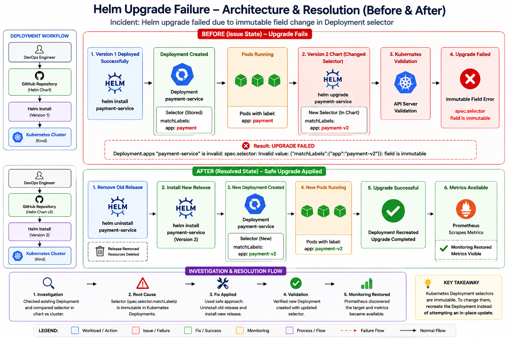

<div align="center">

# 🚀 Helm Upgrade Failure – Kubernetes Immutable Field Incident 




</div>

---

# 📌 Project Overview

This project demonstrates a real-world Kubernetes deployment incident involving a failed Helm upgrade operation.

The objective was to investigate why a production deployment failed after a Helm chart modification and implement a safe upgrade strategy.

The incident occurred when a Deployment selector was modified between application versions, causing Kubernetes to reject the upgrade request because Deployment selectors are immutable fields.

This project covers:

* Helm Deployment Management
* Kubernetes Deployment Selectors
* Immutable Field Validation
* Incident Investigation
* Root Cause Analysis
* Safe Upgrade Techniques
* Deployment Validation

---

# 🚨 Incident Summary

### Deployment Version 1

The application was initially deployed using:

```yaml
matchLabels:
  app: payment
```

Deployment command:

```bash
helm install payment-service .
```

Deployment completed successfully.

---

### Deployment Version 2

The Helm chart was modified to:

```yaml
matchLabels:
  app: payment-v2
```

Upgrade command:

```bash
helm upgrade payment-service .
```

Result:

```text
UPGRADE FAILED

Deployment.apps "payment-service" is invalid:

spec.selector:
Invalid value:
{"matchLabels":{"app":"payment-v2"}}

field is immutable
```

---

# 🏗️ Architecture at a Glance

```text
Version 1 Deployment
        │
        ▼
helm install
        │
        ▼
Deployment Created
        │
        ▼
Selector Stored
(app: payment)
        │
        ▼
Version 2 Upgrade
        │
        ▼
helm upgrade
        │
        ▼
Selector Changed
(app: payment-v2)
        │
        ▼
Kubernetes Validation
        │
        ▼
Immutable Field Error
        │
        ▼
Upgrade Failed
```

---

# 🔍 Root Cause Analysis

Kubernetes Deployments use selectors to identify which Pods belong to the Deployment.

Version 1 selector:

```yaml
matchLabels:
  app: payment
```

Version 2 selector:

```yaml
matchLabels:
  app: payment-v2
```

During the upgrade, Helm attempted to modify:

```yaml
spec.selector.matchLabels
```

Kubernetes rejected the request because Deployment selectors cannot be modified after resource creation.

---

# ⚠️ Why Immutable Field Errors Occur

Deployment selectors are critical to Kubernetes workload management.

Selectors determine:

* Which Pods belong to a Deployment
* Which Pods are managed during scaling
* Which Pods receive rolling updates

If Kubernetes allowed selector changes:

```yaml
app: payment
```

↓

```yaml
app: payment-v2
```

the Deployment could lose control of its existing Pods.

To prevent accidental orphaning of workloads, Kubernetes marks:

```yaml
spec.selector
```

as immutable.

---

# 🔧 Safe Upgrade Approaches

## Option 1 – Recreate Deployment (Used in this Project)

Remove the existing release:

```bash
helm uninstall payment-service
```

Install the updated release:

```bash
helm install payment-service .
```

Advantages:

* Simple
* Safe
* Works for selector changes

---

## Option 2 – Keep Selectors Constant

Recommended production practice:

```yaml
matchLabels:
  app: payment
```

Only update:

* Image tags
* Resources
* Environment variables
* Replicas

Avoid changing selectors.

---

## Option 3 – Create New Deployment

Example:

```yaml
payment-service-v2
```

instead of:

```yaml
payment-service
```

Both deployments can coexist.

---

# 🧪 Validation Process

## Step 1 – Install Version 1

```bash
helm install payment-service .
```

Verify:

```bash
kubectl get deployment payment-service -o yaml | findstr "app:"
```

Output:

```text
app: payment
```

---

## Step 2 – Modify Selector

Changed:

```yaml
app: payment
```

to:

```yaml
app: payment-v2
```

Verify:

```bash
helm template payment-service . | findstr app:
```

Output:

```text
app: payment-v2
```

---

## Step 3 – Reproduce Failure

```bash
helm upgrade payment-service .
```

Result:

```text
field is immutable
```

---

## Step 4 – Apply Fix

```bash
helm uninstall payment-service

helm install payment-service .
```

---

## Step 5 – Validate Deployment

```bash
kubectl get deployment payment-service -o yaml | findstr "app:"
```

Output:

```text
app: payment-v2
```

Validation successful.

---

# 📂 Project Structure

```text
Helm Upgrade Failure
│
├── README.md
├── investigation.md
├── validation.md
├── evidence.md
│
├── Architecture
│   └── architecture.png
│
└── payment-service
    ├── Chart.yaml
    ├── values.yaml
    ├── charts
    └── templates
```

---

# 📈 Investigation Workflow

```text
1. Deploy Version 1
          │
          ▼
2. Modify Selector
          │
          ▼
3. Execute Helm Upgrade
          │
          ▼
4. Reproduce Failure
          │
          ▼
5. Identify Root Cause
          │
          ▼
6. Apply Safe Upgrade
          │
          ▼
7. Validate New Deployment
```

---

# 🎯 Key Learnings

✅ Helm Upgrade Troubleshooting

✅ Kubernetes Deployment Selectors

✅ Immutable Kubernetes Fields

✅ Incident Investigation Techniques

✅ Root Cause Analysis

✅ Safe Upgrade Strategies

✅ Production Deployment Best Practices

---

<div align="center">

# 👨‍💻 Author

**NIHAL N** — DevOps & Cloud Engineer

---

⭐ If this project helped you understand Kubernetes deployment failures, consider giving it a star.

</div>
