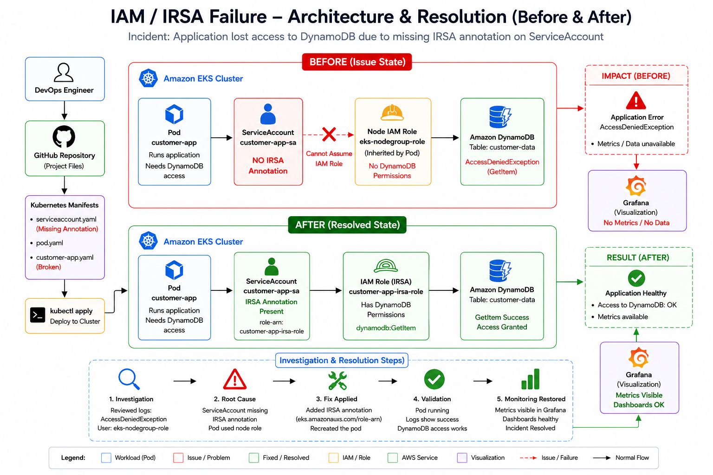

<div align="center">

# 🔐 IAM / IRSA Failure Investigation & Resolution




</div>

---

# 📖 Project Overview

This project simulates a real-world Amazon EKS production incident where an application suddenly lost access to Amazon DynamoDB.

The investigation revealed that the application pod was using the EKS worker node IAM role instead of the intended IAM Role for Service Accounts (IRSA) role.

As a result, DynamoDB access requests failed with an AccessDeniedException.

This repository demonstrates:

* Incident Reproduction
* Investigation Process
* Root Cause Analysis
* IRSA Fix Implementation
* Validation Testing
* Architecture Before & After
* Complete Documentation

---

# 🚨 Incident Summary

## Incident

Application suddenly cannot read DynamoDB.

## Error

```text
2026-05-10T08:12:13Z ERROR

botocore.exceptions.ClientError:
An error occurred (AccessDeniedException)
when calling the GetItem operation:

User:
arn:aws:sts::123456789012:assumed-role/eks-nodegroup-role

is not authorized to perform:

dynamodb:GetItem

on resource:

arn:aws:dynamodb:ap-south-1:123456789012:table/customer-data
```

---

# 🏗️ Current Architecture

```text
Pod
 ↓
ServiceAccount
 ↓
IAM Role (IRSA)
 ↓
DynamoDB
```

---

# 📂 Repository Structure

```text
IAM-IRSA-Failure
│
├── Architecture
│   └── architecture.md
│
├── evidence
│   └── evidence.md
│
├── investigation
│   └── investigation.md
│
├── manifests
│   ├── customer-app.yaml
│   └── customer-app-fixed.yaml
│
├── README.md
│
└── validation.md
```

---

# 🔍 Investigation Workflow

## Step 1 – Review Application Logs

```bash
kubectl logs customer-app
```

Finding:

```text
AccessDeniedException
```

Application was using:

```text
eks-nodegroup-role
```

instead of the intended IRSA role.

---

## Step 2 – Verify ServiceAccount

```bash
kubectl get sa customer-app-sa -o yaml
```

Finding:

```yaml
metadata:
  name: customer-app-sa
```

Missing:

```yaml
eks.amazonaws.com/role-arn
```

---

## Step 3 – Verify Pod Configuration

```bash
kubectl get pod customer-app -o yaml | findstr serviceAccount
```

Finding:

```text
serviceAccountName: customer-app-sa
```

The pod was correctly using the ServiceAccount.

---

# 🎯 Root Cause Analysis

The ServiceAccount was missing the required IRSA annotation.

Because no IAM Role was associated with the ServiceAccount, the pod inherited credentials from the EKS worker node IAM role.

The node role did not have permission to execute:

```text
dynamodb:GetItem
```

against the DynamoDB table.

This resulted in:

```text
AccessDeniedException
```

---

# 🛠️ Fix Implementation

## Before

```yaml
apiVersion: v1
kind: ServiceAccount
metadata:
  name: customer-app-sa
```

---

## After

```yaml
apiVersion: v1
kind: ServiceAccount
metadata:
  name: customer-app-sa
  annotations:
    eks.amazonaws.com/role-arn: arn:aws:iam::123456789012:role/customer-app-irsa-role
```

---

## Apply Fix

```bash
kubectl delete pod customer-app

kubectl apply -f manifests/customer-app-fixed.yaml
```

---

# ✅ Validation

## Verify ServiceAccount

```bash
kubectl get sa customer-app-sa -o yaml
```

Result:

```yaml
annotations:
  eks.amazonaws.com/role-arn: arn:aws:iam::123456789012:role/customer-app-irsa-role
```

PASS ✅

---

## Verify Pod Status

```bash
kubectl get pods
```

Result:

```text
customer-app   1/1 Running
```

PASS ✅

---

## Verify Application Logs

```bash
kubectl logs customer-app
```

Result:

```text
Assuming IAM role via IRSA...
Successfully authenticated
DynamoDB GetItem succeeded
```

PASS ✅

---

# 🏛️ Architecture – Before Fix

```text
Pod
 ↓
ServiceAccount
 ↓
No IRSA Annotation
 ↓
Node IAM Role
 ↓
DynamoDB
 ↓
AccessDeniedException
```

---

# 🏛️ Architecture – After Fix

```text
Pod
 ↓
ServiceAccount
 ↓
IRSA Annotation
 ↓
IAM Role
 ↓
DynamoDB
 ↓
GetItem Success
```

---

# 📊 Investigation Timeline

```text
Application Error
        │
        ▼
AccessDeniedException
        │
        ▼
Review Logs
        │
        ▼
Verify ServiceAccount
        │
        ▼
Missing IRSA Annotation
        │
        ▼
Identify Root Cause
        │
        ▼
Apply Fix
        │
        ▼
Validate Access
        │
        ▼
Incident Resolved
```

---

# 📚 Key Learnings

* How IAM Roles for Service Accounts (IRSA) work in Amazon EKS
* Difference between Node IAM Roles and Pod IAM Roles
* How to troubleshoot AccessDeniedException errors
* How ServiceAccount annotations map pods to IAM roles
* How to perform structured incident investigation and root cause analysis
* How to validate IAM authentication issues in Kubernetes workloads

---

<div align="center">

## 👨‍💻 Author

**NIHAL N** 

  DevSecOps & Cloud Engineer

[](https://www.linkedin.com/in/nihal-n-cse/)

---

⭐ If this project helped you learn EKS IAM & IRSA troubleshooting, give it a star!

</div>
