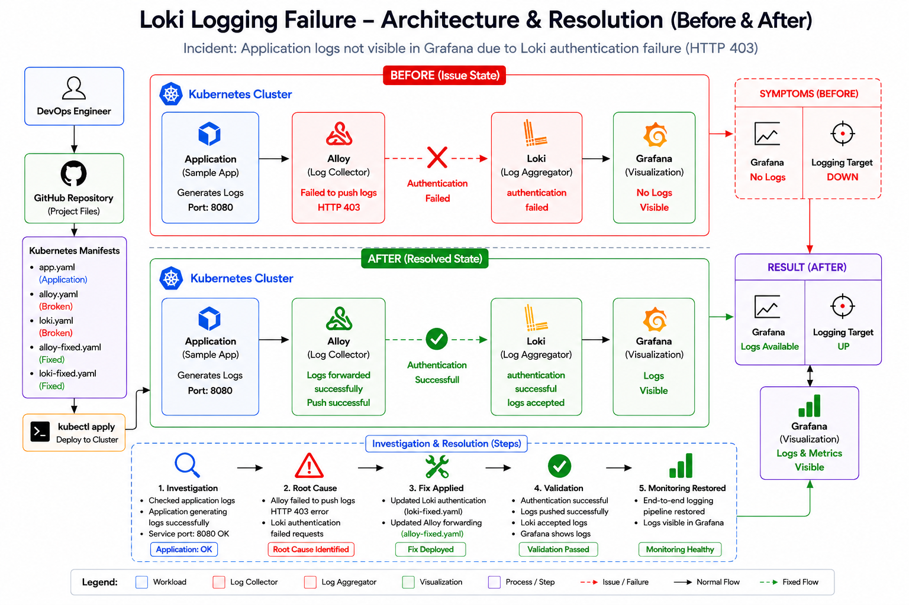

<div align="center">

# 🚨 Loki Logging Failure Investigation




</div>

---

# 📖 Incident Summary

A production logging outage occurred where application logs stopped appearing in Grafana.

Investigation revealed that Alloy was unable to forward logs to Loki because authentication requests were being rejected with **HTTP 403 Forbidden**.

As a result:

```text
Application
     ↓
Alloy
     ↓
HTTP 403
     ↓
Loki Authentication Failure
     ↓
Grafana No Logs
```

---

# 🎯 Objective

Investigate and resolve a logging pipeline failure by tracing log flow through:

```text
Application
     ↓
Alloy
     ↓
Loki
     ↓
Grafana
```

Determine:

* Where logs stopped flowing
* Root cause of failure
* Corrective action
* Validation of recovery

---

# 🏗️ Architecture

## Before Fix

```text
Application
     ↓
Alloy
     ↓
HTTP 403 Error
     ↓
Loki Authentication Failed
     ↓
Grafana No Logs
```

## After Fix

```text
Application
     ↓
Alloy
     ↓
Authentication Successful
     ↓
Loki Accepts Logs
     ↓
Grafana Logs Visible
```

---

# 📂 Project Structure

```text
Loki Logging Failure
│
├── architecture
│   └── architecture.png
│
├── investigation
│   └── investigation.md
│
├── evidence
│   └── evidence.md
│
├── manifests
│   ├── app.yaml
│   ├── alloy.yaml
│   ├── alloy-fixed.yaml
│   ├── loki.yaml
│   └── loki-fixed.yaml
│
├── validation.md
└── README.md
```

---

# 🔍 Investigation Process

## Step 1 – Verify Application

Command:

```bash
kubectl logs sample-app --tail=10
```

Result:

```text
INFO Payment processed
```

Finding:

✅ Application generating logs successfully

---

## Step 2 – Verify Alloy

Command:

```bash
kubectl logs alloy
```

Result:

```text
failed to push logs
HTTP 403
```

Finding:

✅ Alloy receiving logs

❌ Failed to push logs to Loki

---

## Step 3 – Verify Loki

Command:

```bash
kubectl logs loki
```

Result:

```text
authentication failed
```

Finding:

❌ Loki rejected incoming requests

---

# 🚨 Root Cause Analysis

The logging pipeline failed because Loki authentication was misconfigured.

Alloy attempted to push logs successfully, but Loki rejected requests with:

```text
HTTP 403 Forbidden
```

This prevented logs from reaching Grafana.

Root Cause:

```text
Invalid / Missing Authentication Configuration
Between Alloy and Loki
```

---

# 🔧 Fix Implementation

## Loki Fix

Updated Loki authentication configuration.

File:

```text
manifests/loki-fixed.yaml
```

Result:

```text
authentication successful
logs accepted
```

---

## Alloy Fix

Updated Alloy forwarding configuration.

File:

```text
manifests/alloy-fixed.yaml
```

Result:

```text
logs forwarded successfully
push successful
```

---

# ✅ Validation

## Alloy

```bash
kubectl logs alloy
```

Output:

```text
logs forwarded successfully
push successful
```

Status:

✅ PASS

---

## Loki

```bash
kubectl logs loki
```

Output:

```text
authentication successful
logs accepted
```

Status:

✅ PASS

---

## End-to-End Validation

```text
Application
     ↓
Alloy
     ↓
Loki
     ↓
Grafana
```

Result:

✅ Logging pipeline restored

✅ Logs visible in Grafana

---

# 📚 Key Learnings

* How Alloy forwards logs to Loki
* Loki authentication workflow
* Troubleshooting HTTP 403 errors
* Log pipeline investigation methodology
* Root cause analysis techniques
* Validation of observability components
* Production incident response workflow

---

## 🛠️ Technologies Used

| Component | Purpose |
|-----------|----------|
| Kubernetes | Container Orchestration |
| Alloy | Log Collection & Forwarding |
| Loki | Log Aggregation & Storage |
| Grafana | Log Visualization |
| kubectl | Kubernetes Cluster Operations |

---

<div align="center">

## 👨‍💻 Author

### NIHAL N
**DevOps & Cloud Engineer**


⭐ If you found this project useful, consider giving it a star.

</div>

---