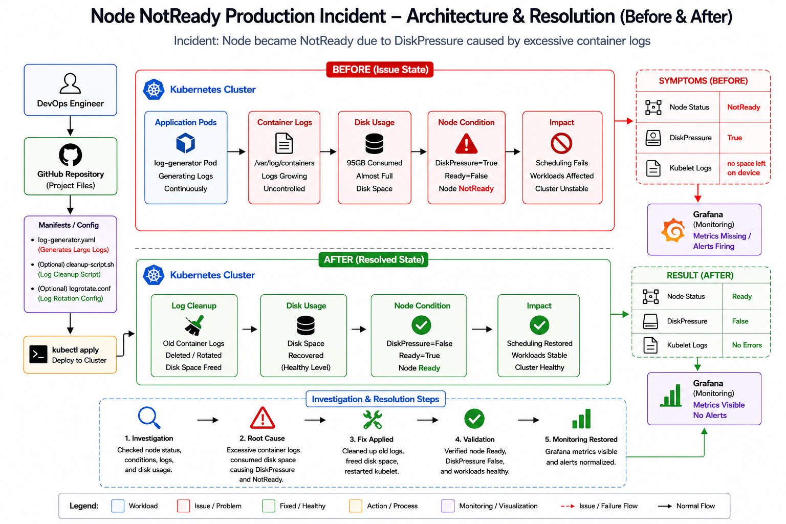

<div align="center">

# 🚨 Node NotReady Production Incident – Kubernetes Troubleshooting & Recovery




</div>

---

# 📖 Project Overview

This project simulates a real-world Kubernetes production incident where a cluster node transitioned to a **NotReady** state due to disk exhaustion.

The investigation revealed that excessive container log growth under:

```bash
/var/log/containers
```

consumed nearly all available disk capacity.

As a result:

* Node entered NotReady state
* DiskPressure condition became True
* Kubelet operations were impacted
* New workloads could not be scheduled
* Cluster stability was degraded

The incident was investigated, root cause identified, corrective actions applied, and the node successfully recovered.

---

# 🚨 Incident Details

## Production Alert

Node health monitoring reported:

```text
Node Status: NotReady
```

Further investigation showed:

```text
DiskPressure=True
```

Kubelet logs contained:

```text
no space left on device
```

---

# 📂 Project Structure

```text
Node NotReady Production Incident
│
├── architecture
│   └── architecture.png
│
├── evidence
│   └── evidence.md
│
├── investigation
│   └── investigation.md
│
├── manifests
│   ├── log-generator.yaml
│   └── fix-commands.txt
│
├── validation.md
└── README.md
```

---

# 🏗️ Architecture Overview

## BEFORE FIX

```text
Application Pods
        │
        ▼
Container Logs
(/var/log/containers)
        │
        ▼
95GB Consumed
        │
        ▼
DiskPressure=True
        │
        ▼
Node NotReady
        │
        ▼
Scheduling Failure
```

---

## AFTER FIX

```text
Application Pods
        │
        ▼
Log Cleanup
        │
        ▼
Disk Space Recovered
        │
        ▼
DiskPressure=False
        │
        ▼
Node Ready
        │
        ▼
Scheduling Restored
```

---

# 🔍 Investigation Process

## Step 1 – Node Health Check

```bash
kubectl get nodes
```

Finding:

```text
docker-desktop NotReady
```

Conclusion:

Node unavailable for scheduling.

---

## Step 2 – Node Condition Analysis

```bash
kubectl describe node docker-desktop
```

Finding:

```text
DiskPressure=True
Ready=False
```

Conclusion:

Storage exhaustion impacting kubelet.

---

## Step 3 – Kubelet Investigation

```bash
journalctl -u kubelet
```

Finding:

```text
no space left on device
```

Conclusion:

Kubelet unable to write files due to disk exhaustion.

---

## Step 4 – Disk Usage Analysis

```bash
du -sh /var/log/containers/*
```

Finding:

```text
95GB consumed
```

Conclusion:

Container logs consuming excessive storage.

---

# 🎯 Root Cause Analysis

The root cause was uncontrolled growth of container log files located under:

```bash
/var/log/containers
```

This resulted in:

```text
DiskPressure=True
```

which forced Kubernetes to mark the node as:

```text
NotReady
```

---

# 🛠️ Fix Implementation

## Verify Disk Usage

```bash
du -sh /var/log/containers/*
```

## Remove Old Container Logs

```bash
find /var/log/containers -type f -name "*.log" -delete
```

## Restart Kubelet

```bash
systemctl restart kubelet
```

## Verify Recovery

```bash
kubectl get nodes
```

---

# ✅ Validation

## Validation Check 1

```bash
kubectl get nodes
```

Result:

```text
docker-desktop Ready
```

Status:

✅ PASS

---

## Validation Check 2

```bash
kubectl describe node docker-desktop
```

Result:

```text
DiskPressure=False
Ready=True
```

Status:

✅ PASS

---

## Validation Check 3

```bash
df -h
```

Result:

```text
Disk utilization returned to healthy levels
```

Status:

✅ PASS

---

# 📊 Incident Timeline

```text
Container Logs Grow
          │
          ▼
Disk Usage Reaches 95GB
          │
          ▼
DiskPressure=True
          │
          ▼
Node NotReady
          │
          ▼
Investigation
          │
          ▼
Root Cause Identified
          │
          ▼
Log Cleanup
          │
          ▼
Disk Space Recovered
          │
          ▼
Node Ready
```

---

# 📚 Key Learnings

✅ Node NotReady incidents are frequently caused by resource pressure.

✅ DiskPressure directly impacts kubelet functionality.

✅ Container logs can consume significant disk capacity if not managed properly.

✅ Regular log rotation is critical in Kubernetes production environments.

✅ Monitoring node conditions helps detect failures before service impact occurs.

✅ Proper troubleshooting requires validation at every layer:

* Node Health
* Node Conditions
* Kubelet Logs
* Disk Usage
* Recovery Verification

---

# 🎯 Skills Demonstrated

* Kubernetes Administration
* Incident Response
* Production Troubleshooting
* Root Cause Analysis
* Linux Log Management
* Node Health Investigation
* Cluster Recovery
* Documentation & Reporting

---

<div align="center">

## 👨‍💻 Author

**NIHAL N — DevOps & Cloud Engineer**


⭐ If this project helped you learn Kubernetes troubleshooting, consider starring the repository.

</div>

---