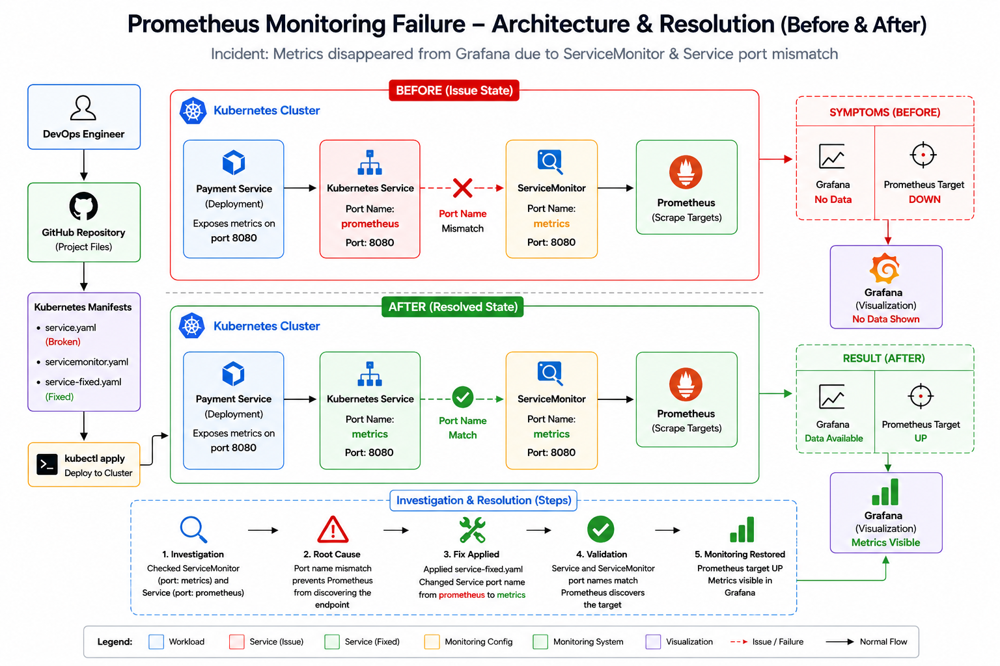

<div align="center">

# 📊 Prometheus Monitoring Failure – Incident Response & Resolution 




</div>

---

# 📂 Project Structure

| File | Description |
|--------|-------------|
| 📄 README.md | Project documentation |
| 📄 service.yaml | Broken Service configuration |
| 📄 servicemonitor.yaml | ServiceMonitor configuration |
| 📄 service-fixed.yaml | Fixed Service configuration |
| 📄 investigation.md | Root cause investigation report |
| 📄 validation.md | Validation report |
| 📄 evidence.md | Evidence collected before and after fix |
| 🖼️ Architecture/arch.png | Architecture and resolution workflow |

---

# 🧠 Project Overview

This project simulates a real-world Kubernetes monitoring incident where application metrics suddenly disappear from Grafana dashboards.

The monitoring stack consists of:

- ☸️ Kubernetes
- 🔥 Prometheus
- 📊 Grafana
- 🔎 ServiceMonitor

The incident occurs because Prometheus is unable to discover the payment-service metrics endpoint due to a configuration mismatch between the Kubernetes Service and the ServiceMonitor.

The objective of this project is to:

- Investigate the monitoring outage
- Identify the root cause
- Apply the corrective fix
- Validate the recovery
- Document the incident response process

---

# 🚨 Incident Scenario

## Symptoms Observed

```text
Grafana: No Data

Prometheus Target:
payment-service DOWN

Prometheus Logs:
context deadline exceeded
```

### Impact

- Metrics collection stopped
- Dashboards displayed no data
- Service observability was lost
- Monitoring alerts could not function correctly

---

# 🏗️ Architecture at a Glance

```text
Payment Service
       │
       ▼
 Kubernetes Service
       │
       ▼
 ServiceMonitor
       │
       ▼
 Prometheus
       │
       ▼
 Grafana
```

---

# ⚠️ Root Cause Investigation

## ServiceMonitor Configuration

```yaml
apiVersion: monitoring.coreos.com/v1
kind: ServiceMonitor
spec:
  endpoints:
    - port: metrics
```

## Service Configuration (Broken)

```yaml
apiVersion: v1
kind: Service
spec:
  ports:
    - name: prometheus
```

### Root Cause

The ServiceMonitor was configured to scrape a port named:

```text
metrics
```

while the Service exposed a port named:

```text
prometheus
```

Since Prometheus discovers endpoints using port names, the mismatch prevented target discovery.

---

# 🔄 Failure Workflow

```text
ServiceMonitor
(port: metrics)
        │
        ▼
Service
(name: prometheus)
        │
        ▼
Port Name Mismatch
        │
        ▼
Prometheus Target DOWN
        │
        ▼
Grafana No Data
```

---

# 🛠️ Resolution

The issue was resolved using:

```text
service-fixed.yaml
```

### Updated Service Configuration

```yaml
apiVersion: v1
kind: Service
spec:
  ports:
    - name: metrics
```

### Result

The Service and ServiceMonitor now use the same port name:

```text
metrics
```

allowing Prometheus to discover the endpoint successfully.

---

# ✅ Validation

### ServiceMonitor

```text
Port: metrics
```

### Service

```text
Port: metrics
```

### Validation Outcome

- ✅ Port names matched successfully
- ✅ Prometheus target discovery restored
- ✅ Monitoring configuration corrected
- ✅ Metrics available again

---

# 📊 Before vs After

| Component | Before Fix | After Fix |
|------------|------------|------------|
| Service Port Name | prometheus | metrics |
| ServiceMonitor Port | metrics | metrics |
| Prometheus Target | DOWN | UP |
| Grafana Dashboard | No Data | Metrics Available |
| Monitoring Status | Failed | Restored |

---

# 🧪 Commands Used

## Deploy Broken Configuration

```bash
kubectl apply -f service.yaml
kubectl apply -f servicemonitor.yaml
```

## Investigation

```bash
kubectl describe servicemonitor payment-service
kubectl describe svc payment-service
```

## Apply Fix

```bash
kubectl apply -f service-fixed.yaml
```

## Validation

```bash
kubectl get servicemonitor
kubectl get svc payment-service
```

---

# 📈 Incident Resolution Workflow

```text
Incident Reported
        │
        ▼
Investigation
        │
        ▼
Configuration Review
        │
        ▼
Root Cause Identification
        │
        ▼
Apply Fix
        │
        ▼
Validation
        │
        ▼
Monitoring Restored
```

---

# 🎯 Key Learnings

- Understanding Prometheus Service Discovery
- Troubleshooting ServiceMonitor issues
- Kubernetes Service configuration validation
- Root Cause Analysis (RCA)
- Monitoring incident resolution
- Production troubleshooting workflow

---

<div align="center">

# 👨‍💻 Author

**NIHAL N** — DevOps & Cloud Engineer

⭐ If this project helped you understand Kubernetes monitoring troubleshooting, consider giving it a star.

</div>
