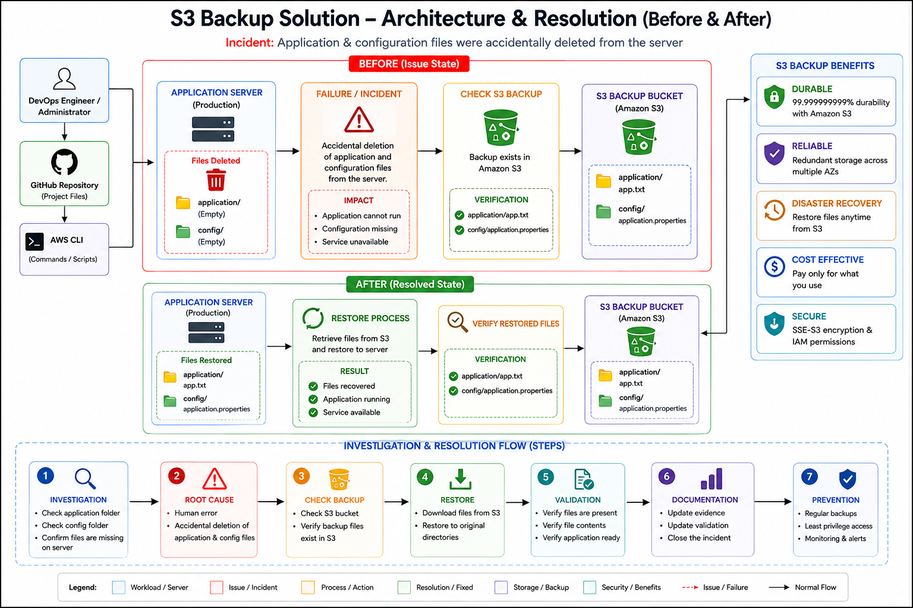

<div align="center">

# ☁️ AWS S3 Backup & Disaster Recovery Solution




</div>

---

# 📖 Project Overview

This project demonstrates a **production-style backup and disaster recovery solution** using **Amazon S3**.

The objective is to protect critical application files and configuration files by securely storing backups in Amazon S3 and restoring them whenever data loss occurs.

The project simulates a real-world production incident where application files are accidentally deleted from the server and are successfully recovered using Amazon S3 backups.

---

# 📂 Project Structure

```
S3 Backup Solution
│
├── Architecture
│
├── application
│   └── app.txt
│
├── backup
│
├── config
│   └── application.properties
│
├── evidence
│   └── evidence.md
│
├── restore
│
├── investigation.md
│
├── validation.md
│
└── README.md
```

---

# 🏗 Architecture

```
                    Production Server
                           │
        ┌──────────────────┼──────────────────┐
        │                  │                  │
        ▼                  ▼                  ▼

 Application Files   Configuration Files   AWS CLI

        │                  │
        └──────────────┬───┘
                       │
               Backup Process
                       │
                       ▼

             Amazon S3 Bucket
      (Centralized Backup Storage)

                       │
              Restore Process
                       │
                       ▼

         Production Server Restored
```

---

# 🔄 Backup Workflow

```
Application Files

        │

        ▼

Configuration Files

        │

        ▼

AWS CLI

        │

        ▼

Amazon S3 Bucket

        │

        ▼

Secure Backup Stored
```

---

# 🚨 Incident Scenario

During routine maintenance, the application server experienced accidental deletion of local files.

Deleted Items

```
application/

config/
```

Impact

- Application files unavailable

- Configuration files missing

- Recovery required

Fortunately, a backup already existed inside Amazon S3.

---

# 🔍 Investigation

## Verify Local Files

```powershell
tree /F
```

Result

```
application/

config/
```

Files missing.

---

## Verify Backup

```powershell
aws s3 ls s3://nihal-s3-backup-solution-928974129633 --recursive
```

Result

```
application/app.txt

config/application.properties
```

Backup available.

---

# ⚠ Root Cause Analysis

```
Human Error

        │

        ▼

Application Files Deleted

        │

        ▼

Configuration Deleted

        │

        ▼

Local Recovery Impossible

        │

        ▼

Restore Required
```

---

# 🔧 Disaster Recovery

Restore application files

```powershell
aws s3 cp s3://nihal-s3-backup-solution-928974129633/application application --recursive
```

Restore configuration files

```powershell
aws s3 cp s3://nihal-s3-backup-solution-928974129633/config config --recursive
```

---

# ✅ Validation

Verify project

```powershell
tree /F
```

Verify application

```powershell
type application\app.txt
```

Verify configuration

```powershell
type config\application.properties
```

Verify backup

```powershell
aws s3 ls s3://nihal-s3-backup-solution-928974129633 --recursive
```

---

# 📊 Validation Results

| Validation | Status |
|------------|--------|
| Project Created | ✅ PASS |
| S3 Bucket Created | ✅ PASS |
| Backup Uploaded | ✅ PASS |
| Failure Simulated | ✅ PASS |
| Restore Completed | ✅ PASS |
| File Validation | ✅ PASS |
| Backup Verified | ✅ PASS |

---

# ☁ AWS Services Used

| Service | Purpose |
|----------|----------|
| Amazon S3 | Backup Storage |
| AWS CLI | Backup & Restore Automation |
| IAM | Authentication & Authorization |

---

# 💻 Commands Used

## Create Bucket

```powershell
aws s3 mb s3://nihal-s3-backup-solution-928974129633
```

---

## Upload Files

```powershell
aws s3 cp application s3://nihal-s3-backup-solution-928974129633/application --recursive

aws s3 cp config s3://nihal-s3-backup-solution-928974129633/config --recursive
```

---

## Restore Files

```powershell
aws s3 cp s3://nihal-s3-backup-solution-928974129633/application application --recursive

aws s3 cp s3://nihal-s3-backup-solution-928974129633/config config --recursive
```

---

## Verify Backup

```powershell
aws s3 ls s3://nihal-s3-backup-solution-928974129633 --recursive
```

---

# 🎯 Key Learnings

- Amazon S3 provides highly durable backup storage.
- Disaster recovery should always be tested, not just implemented.
- Regular backups minimize recovery time.
- AWS CLI enables repeatable backup automation.
- Backup verification is as important as backup creation.
- Recovery procedures should be documented and validated.

---

<div align="center">

# 👨‍💻 Author

## **NIHAL N**

**DevOps | Cloud | AWS | Kubernetes**

[](https://www.linkedin.com/in/nihal-n-cse/)


⭐ If this project helped you understand **AWS Backup & Disaster Recovery using Amazon S3**, consider giving this repository a **⭐**.

</div>

---
