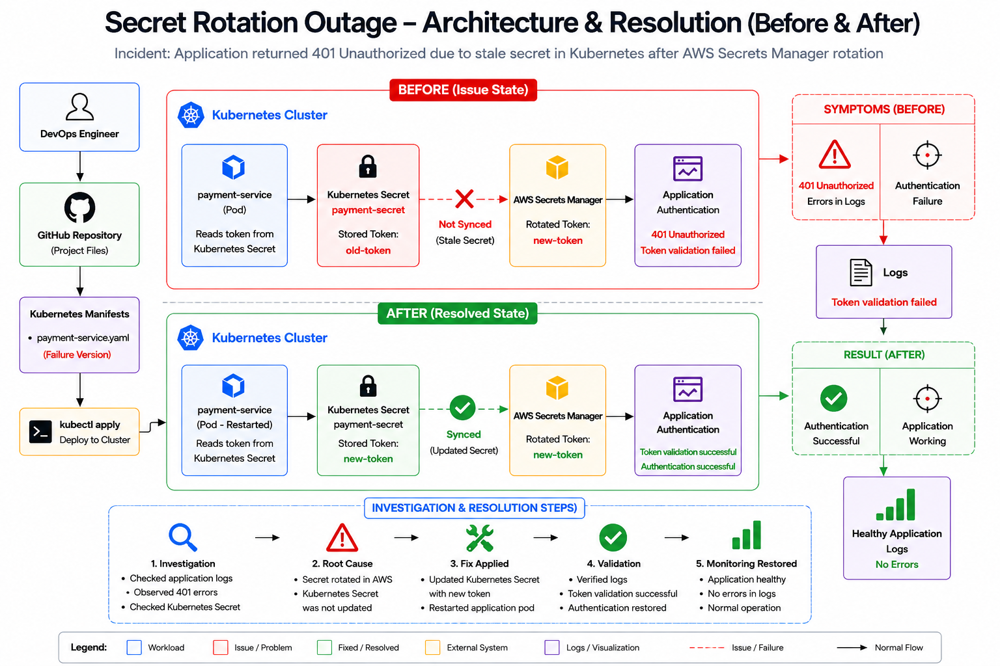

<div align="center">

# 🔐 Secret Rotation Outage Investigation & Resolution




</div>

---

## 📂 Directories

| Folder               | Description                                               |
| -------------------- | --------------------------------------------------------- |
| 📁 **manifests**     | Kubernetes manifests for failure and fixed scenarios      |
| 📁 **investigation** | Root Cause Analysis and investigation findings            |
| 📁 **evidence**      | Collected logs, secret inspection and validation evidence |
| 📁 **architecture**  | Architecture diagrams and flow documentation              |
| 📄 **validation.md** | Validation and recovery verification report               |

---

## 🧠 Project Overview

This project demonstrates a real-world **Secret Rotation Outage Investigation** in Kubernetes.

The incident occurred after an **AWS Secrets Manager rotation** where the application continued using an outdated Kubernetes Secret. As a result, authentication requests failed and users received **401 Unauthorized** responses.

The project walks through the complete troubleshooting lifecycle:

* Incident Detection
* Investigation
* Secret Verification
* Root Cause Analysis
* Secret Synchronization
* Validation
* Recovery Documentation

---

## 🏗️ Architecture at a Glance

```text
AWS Secrets Manager
        │
        ▼
Secret Rotated
(new-token)
        │
        X
        │ Not Synced
        ▼
Kubernetes Secret
(old-token)
        │
        ▼
payment-service
        │
        ▼
401 Unauthorized
        │
        ▼
Authentication Failure
```

### Fixed Flow

```text
AWS Secrets Manager
        │
        ▼
Secret Rotated
(new-token)
        │
        ▼
Secret Synchronization
        │
        ▼
Kubernetes Secret
(new-token)
        │
        ▼
payment-service
        │
        ▼
Authentication Successful
```

---

## 🔧 Tech Stack

| Layer            | Tool                | Purpose                        |
| ---------------- | ------------------- | ------------------------------ |
| ☁️ Cloud         | AWS Secrets Manager | Secret storage and rotation    |
| ☸️ Orchestration | Kubernetes          | Application hosting            |
| 🔐 Secrets       | Kubernetes Secrets  | Application credential storage |
| 🔍 Investigation | kubectl             | Troubleshooting and validation |
| 📊 Documentation | Markdown            | Incident reporting             |
| 🚀 Application   | payment-service     | Authentication service         |

---

## 🚨 Incident Details

### Symptoms

Application users experienced authentication failures.

Observed errors:

```text
401 Unauthorized
Token validation failed
```

### Application Logs

```text
Using token from Kubernetes Secret...
401 Unauthorized
Token validation failed
```

### Kubernetes Secret

```bash
kubectl get secret payment-secret
```

Investigation revealed that the secret had not been refreshed after AWS rotation.

---

## 🔍 Investigation Workflow

### 1️⃣ Application Log Analysis

```bash
kubectl logs payment-service
```

Observed:

```text
401 Unauthorized
Token validation failed
```

Finding:

✅ Authentication issue confirmed

---

### 2️⃣ Secret Inspection

```bash
kubectl get secret payment-secret -o yaml
```

Output:

```yaml
data:
  token: b2xkLXRva2Vu
```

Finding:

✅ Secret contains encoded token

---

### 3️⃣ Secret Verification

Decoded token:

```text
old-token
```

Finding:

✅ Kubernetes Secret contains stale credentials

---

### 4️⃣ Secret Rotation Validation

AWS Secrets Manager:

```text
new-token
```

Kubernetes Secret:

```text
old-token
```

Finding:

❌ Secret rotation did not propagate

---

## 🎯 Root Cause Analysis

### Root Cause

AWS Secrets Manager successfully rotated the application token.

However, Kubernetes Secret **payment-secret** was never synchronized after rotation.

The application continued using stale credentials which caused authentication requests to fail.

### Impact

```text
Application Authentication
        │
        ▼
Token Validation Failure
        │
        ▼
401 Unauthorized
```

---

## 🔧 Fix Implementation

### Step 1 – Remove Stale Secret

```bash
kubectl delete secret payment-secret
```

---

### Step 2 – Create Updated Secret

```bash
kubectl create secret generic payment-secret --from-literal=token=new-token
```

---

### Step 3 – Restart Application

```bash
kubectl delete pod payment-service

kubectl apply -f manifests/payment-service-fixed.yaml
```

---

## ✅ Validation

### Verify Secret

```bash
kubectl get secret payment-secret -o yaml
```

Output:

```yaml
data:
  token: bmV3LXRva2Vu
```

Decoded Value:

```text
new-token
```

---

### Verify Application Logs

```bash
kubectl logs payment-service
```

Output:

```text
Using rotated token...
Token validation successful
Authentication successful
```

---

### Validation Result

```text
Authentication Restored
Application Healthy
Incident Resolved
```

---

## 📊 Investigation Summary

| Investigation Area        | Result       |
| ------------------------- | ------------ |
| AWS Secret Rotation       | ✅ Successful |
| Secret Synchronization    | ❌ Failed     |
| Authentication Validation | ❌ Failed     |
| Secret Refresh            | ✅ Successful |
| Application Recovery      | ✅ Successful |
| Incident Resolution       | ✅ Completed  |

---

## 📈 Resolution Workflow

```text
1️⃣ Investigate Logs
        │
        ▼
2️⃣ Inspect Kubernetes Secret
        │
        ▼
3️⃣ Decode Secret Value
        │
        ▼
4️⃣ Compare with AWS Secret
        │
        ▼
5️⃣ Identify Synchronization Failure
        │
        ▼
6️⃣ Update Secret
        │
        ▼
7️⃣ Restart Application
        │
        ▼
8️⃣ Validate Recovery
```

---

## 🏆 Key Learnings

* AWS Secret rotation does not automatically update Kubernetes Secrets.
* Applications may continue using stale credentials.
* Secret synchronization mechanisms must be validated.
* Authentication failures often indicate secret drift.
* Kubernetes Secrets should be refreshed after rotation.
* Post-rotation validation is critical in production environments.
* Incident response requires verification of both source and consumer secrets.

---

<div align="center">

## 👨‍💻 Author

**NIHAL N** — DevOps & Cloud Engineer

[](https://www.linkedin.com/in/nihal-n-cse/)

---

⭐ *If this project helped you learn Kubernetes Secret troubleshooting and incident response, consider starring the repository.*

</div>
